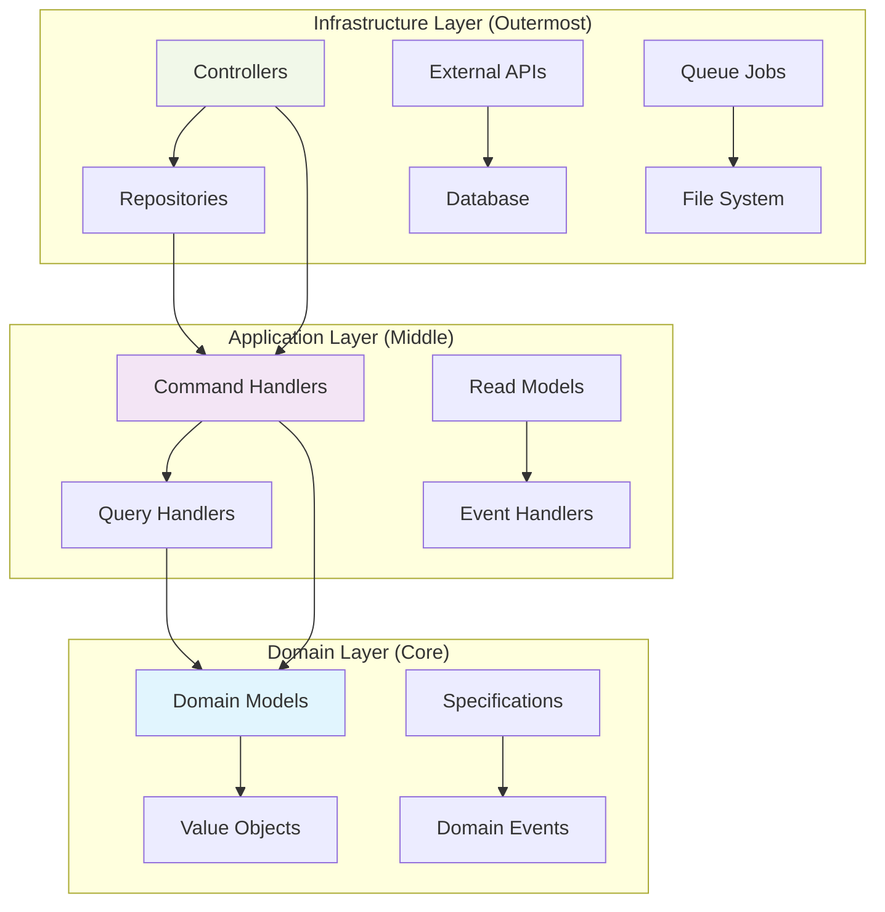

<div align="center">

# ACME Corp CSR Platform

</div>

[](https://github.com/go2digit-al/acme-project/actions/workflows/ci.yml)[](https://laravel.com)
[](https://phpstan.org)
[](https://www.laravel-enlightn.com/docs/security/security-analyzer.html)
[](https://staging.acme-corp.go2digit.al)
[](#quality)
[](#testing)
[](#license)

<div align="center">
  
</div>

Enterprise-grade Corporate Social Responsibility platform built with **Hexagonal Architecture** and **Domain-Driven Design** principles, designed to handle 20,000+ concurrent employees across global operations.

## Architecture Overview

This platform implements a clean, maintainable **Hexagonal Architecture** following **Domain-Driven Design** principles, restructured from traditional Laravel MVC to support enterprise-scale operations.

### Core Design Principles

- **Hexagonal Architecture**: Clean separation between Domain, Application, and Infrastructure layers
- **Domain-Driven Design**: Rich domain models with business logic encapsulation
- **CQRS Pattern**: Separated command (write) and query (read) operations for optimal performance
- **Event-Driven Architecture**: Loose coupling through domain events between modules
- **Repository Pattern**: Interface-based data access abstraction
- **Single Responsibility**: Each class/controller has one clear purpose

### Hexagonal Architecture Layers



### Module Structure

Each module follows strict hexagonal architecture principles:

```
modules/[ModuleName]/
├── Domain/                    # Core business logic (innermost layer)
│   ├── Model/                # Rich domain models with business rules
│   ├── ValueObject/          # Immutable value objects for type safety
│   ├── Repository/           # Repository interfaces (contracts only)
│   ├── Specification/        # Business rule specifications
│   ├── Exception/            # Domain-specific exceptions
│   └── Event/                # Domain events for module communication
├── Application/              # Use case orchestration (middle layer)
│   ├── Command/              # CQRS Commands and Handlers (write operations)
│   ├── Query/                # CQRS Queries and Handlers (read operations)
│   ├── ReadModel/            # Optimized read models for queries
│   └── Service/              # Application services (if needed)
└── Infrastructure/           # External adapters (outermost layer)
    ├── Laravel/              # Laravel-specific implementations
    │   ├── Controllers/      # Single-action controllers
    │   ├── Models/           # Eloquent models (persistence only)
    │   ├── Repository/       # Repository implementations
    │   ├── Migration/        # Database migrations
    │   ├── Factory/          # Model factories for testing
    │   ├── Seeder/           # Database seeders
    │   └── Provider/         # Service providers
    ├── ApiPlatform/          # API Platform adapters
    │   ├── Handler/          # Request processors and providers
    │   └── Resource/         # API resource definitions
    └── Filament/             # Admin interface adapters
        ├── Pages/            # Custom admin pages
        └── Resources/        # Admin resource definitions
```

### Architecture Benefits Achieved

1. **Testability**: Pure domain logic tested without external dependencies
2. **Maintainability**: Clear separation of concerns and responsibilities
3. **Scalability**: Independent module development and deployment
4. **Technology Independence**: Business logic isolated from framework concerns
5. **Team Productivity**: Multiple teams can work independently on different modules

### Documentation

#### Architecture & Design
- [Architecture Decision Records](docs/architecture/adr/)
- [Module Structure Guide](docs/architecture/module-structure.md)
- [Module Interactions](docs/architecture/module-interactions.md)
- [Hexagonal Architecture](docs/architecture/hexagonal-architecture.md)
- [Payment Architecture](docs/architecture/payment-architecture.md)
- [API Platform Design](docs/architecture/api-platform-design.md)

#### Development
- [Developer Guide](docs/development/developer-guide.md)
- [Creating New Modules](docs/development/creating-new-module.md)
- [Migration Guide](docs/development/migration-guide.md)
- [Testing Guide](docs/development/testing-guide.md)
- [CI/CD Pipeline](docs/development/ci-cd-pipeline.md)
- [Localization](docs/development/translation.md)

#### Infrastructure & Operations
- [Docker Deployment](docs/docker/docker-deployment.md)
- [Deployment Guide](docs/infrastructure/deployment.md)
- [Infrastructure Setup](docs/infrastructure/)
- [Security Documentation](docs/security/)
- [Performance Optimization](docs/analysis/performance-gaps.md)
- [Meilisearch Troubleshooting](docs/infrastructure/meilisearch-troubleshooting.md)

#### Quality Assurance
- [Code Quality & Linting](docs/linting/)
- [Testing & Coverage](docs/testing/)
- [Static Analysis](docs/quality/)

#### Specialized Guides
- [Docker Services](docs/docker/) - Container documentation
- [Module Helpers](docs/modules/) - Shared utilities

## Requirements

### System Requirements

- PHP 8.4 or higher
- MySQL 8.0 or higher
- Redis 6.0 or higher
- Node.js 18+ and NPM
- Composer 2.0+
- Meilisearch 1.0+ (for search functionality)

### PHP Extensions

- BCMath PHP Extension
- Ctype PHP Extension
- cURL PHP Extension
- DOM PHP Extension
- Fileinfo PHP Extension
- JSON PHP Extension
- Mbstring PHP Extension
- OpenSSL PHP Extension
- PCRE PHP Extension
- PDO PHP Extension
- Tokenizer PHP Extension
- XML PHP Extension
- Redis PHP Extension

## Installation

### 1. Clone the Repository

```bash
git clone https://github.com/acme-corp/csr-platform.git
cd csr-platform
```

### 2. Install Dependencies

```bash
composer install --optimize-autoloader
npm install
```

### 3. Environment Configuration

```bash
cp .env.example .env
php artisan key:generate
```

Configure your `.env` file with appropriate database, Redis, and service credentials:

```env
DB_CONNECTION=mysql
DB_HOST=127.0.0.1
DB_PORT=3306
DB_DATABASE=acme_corp_csr
DB_USERNAME=your_username
DB_PASSWORD=your_password

REDIS_HOST=127.0.0.1
REDIS_PASSWORD=null
REDIS_PORT=6379

MEILISEARCH_HOST=http://127.0.0.1:7700
MEILISEARCH_KEY=your_master_key

# Payment gateways are configured through Filament 4 Admin Panel
# Navigate to Admin > Settings > Payment Gateways
```

### 4. Database Setup

```bash
# Create database
mysql -u root -p -e "CREATE DATABASE acme_corp_csr CHARACTER SET utf8mb4 COLLATE utf8mb4_unicode_ci;"

# Run migrations
php artisan migrate

# Seed development data (optional)
php artisan db:seed
```

### 5. Search Engine Setup

```bash
# Import search indexes
php artisan scout:import "App\Models\Campaign"
php artisan scout:import "App\Models\Employee"
```

### 6. Build Assets

```bash
npm run build
```

### 7. Cache Configuration

```bash
php artisan config:cache
php artisan route:cache
php artisan view:cache
php artisan event:cache
```

### 8. Queue Workers

```bash
# Start queue workers for background jobs
php artisan queue:work redis --queue=high,default,low --tries=3
```

### 9. Development Server

```bash
php artisan serve
```

The application will be available at `http://localhost:8000`

## Testing

### Test Architecture

The platform implements a comprehensive testing strategy aligned with the hexagonal architecture:

- **Unit Tests**: 3,277 tests (11,291 assertions) covering pure domain logic with no external dependencies
- **Integration Tests**: 245 tests (945 assertions) for infrastructure implementations
- **Feature Tests**: 366 tests (856 assertions) for API endpoint tests
- **Browser Tests**: 15 tests (41 assertions) for E2E scenarios using Pest 4 Browser Plugin
- **Architecture Tests**: Automated boundary validation ensuring hexagonal principles

### Test Structure by Layer

```
tests/
├── Unit/                    # Domain Layer Tests (Pure business logic)
│   └── [Module]/
│       ├── Domain/
│       │   ├── Model/       # Domain model tests
│       │   └── ValueObject/ # Value object tests
│       └── Application/     # Command/Query handler tests (mocked dependencies)
├── Integration/             # Infrastructure Layer Tests
│   └── [Module]/
│       └── Infrastructure/
│           ├── Repository/  # Repository implementation tests
│           └── External/    # External service integration tests
├── Feature/                 # API Tests (End-to-end)
│   └── Api/
│       └── [Module]/        # API endpoint tests
├── Browser/                 # E2E Tests (Pest 4 Browser Plugin)
│   └── [Module]/            # User journey tests
└── Architecture/            # Architectural Boundary Tests
    ├── ModuleBoundariesTest.php
    └── HexagonalArchitectureTest.php
```

### Running Tests

```bash
# Run all tests
./vendor/bin/pest

# Run by test suite
./vendor/bin/pest --testsuite=Unit          # Pure domain logic tests
./vendor/bin/pest --testsuite=Integration   # Infrastructure tests
./vendor/bin/pest --testsuite=Feature       # API endpoint tests

# Run by module
./vendor/bin/pest tests/Unit/User/          # All User module unit tests
./vendor/bin/pest tests/Feature/Api/User/   # User API tests

# Run with parallel execution
./vendor/bin/pest --parallel

# Run browser tests (Pest 4 Browser Plugin)
./vendor/bin/pest tests/Browser/

# Run architecture tests
./vendor/bin/pest tests/Architecture/

# Generate coverage report (requires xdebug/pcov)
./vendor/bin/pest --coverage --coverage-html=coverage --min=90

# Run tests with specific configurations
./vendor/bin/pest --stop-on-failure        # Stop on first failure
./vendor/bin/pest --bail                    # Stop on first error
```

### Test Examples by Architecture Layer

#### Domain Layer Tests (Unit)
```php
// tests/Unit/User/Domain/Model/UserTest.php
test('user can create campaigns when active and verified', function () {
    $user = User::create(
        firstName: 'John',
        lastName: 'Doe', 
        email: new EmailAddress('john@example.com'),
        role: UserRole::EMPLOYEE
    );
    $user->verifyEmail(now());
    
    expect($user->canCreateCampaigns())->toBeTrue();
});
```

#### Infrastructure Layer Tests (Integration)
```php
// tests/Integration/User/Infrastructure/Repository/UserRepositoryTest.php
test('saves and retrieves user from database', function () {
    $user = User::create(/* ... */);
    
    $this->userRepository->save($user);
    $retrieved = $this->userRepository->findById($user->getId());
    
    expect($retrieved)->not->toBeNull();
    expect($retrieved->getEmail())->toEqual($user->getEmail());
});
```

#### API Layer Tests (Feature)
```php
// tests/Feature/Api/User/CreateUserTest.php  
test('creates user with valid data', function () {
    $response = $this->postJson('/api/users', [
        'first_name' => 'Jane',
        'last_name' => 'Doe',
        'email' => 'jane@example.com',
        'role' => 'employee'
    ]);
    
    $response->assertStatus(201);
    $response->assertJsonStructure(['data' => ['id']]);
});
```

#### Browser Tests (E2E)
```php
// tests/Browser/User/UserManagementTest.php
test('admin can create user via UI', function () {
    browse(function (Browser $browser) {
        $browser->loginAs($admin)
                ->visit('/admin/users/create')
                ->type('first_name', 'John')
                ->type('email', 'john@example.com')
                ->press('Create User')
                ->assertSee('User created successfully');
    });
});
```

#### Architecture Tests
```php
// tests/Architecture/HexagonalArchitectureTest.php
test('domain layer has no framework dependencies', function () {
    Arch::expect('Modules\\*\\Domain')
        ->not->toUse(['Illuminate\\*', 'Laravel\\*']);
});

test('infrastructure depends on domain but not vice versa', function () {
    Arch::expect('Modules\\*\\Infrastructure')
        ->toUse('Modules\\*\\Domain');
        
    Arch::expect('Modules\\*\\Domain')
        ->not->toUse('Modules\\*\\Infrastructure');
});
```

### Code Quality

```bash
# Run static analysis (PHPStan Level 8)
./vendor/bin/phpstan analyse

# Check code style
./vendor/bin/pint --test

# Fix code style
./vendor/bin/pint

# Run Rector for automated refactoring
./vendor/bin/rector process

# Check what Rector would change (dry-run)
./vendor/bin/rector process --dry-run

# Check architecture boundaries
./vendor/bin/deptrac analyse

# Run all quality checks (includes Rector)
./vendor/bin/grumphp run
```

## Performance Optimization

### Caching Strategy

- **Redis**: Session storage, cache, and queue management
- **OPcache**: PHP bytecode caching
- **CDN Integration**: Static asset delivery
- **Database Query Cache**: Optimized query performance

### Scaling Capabilities

- Horizontal scaling via load balancers
- Database read replicas for query distribution
- Redis cluster for cache distribution
- Queue workers auto-scaling
- Meilisearch cluster for search scalability

## API Documentation

### API Platform Integration

The platform uses API Platform for automatic API generation and documentation:

```bash
# Access interactive API documentation
http://localhost:8000/api
```

API Platform automatically generates:
- OpenAPI 3.0 specification
- Interactive Swagger UI
- JSON-LD/Hydra support
- GraphQL endpoint (optional)

### Key API Features

- JWT-based authentication
- Rate limiting (60 requests/minute)
- API versioning support
- Comprehensive error handling
- Response pagination and filtering
- Multi-language support

## Security Features

- **Authentication**: Multi-factor authentication support
- **Authorization**: Role-based access control (RBAC)
- **Encryption**: AES-256 encryption for sensitive data
- **Audit Logging**: Complete audit trail for compliance
- **PCI Compliance**: Secure payment processing
- **GDPR Compliance**: Data privacy and protection
- **XSS Protection**: Input sanitization and output encoding
- **CSRF Protection**: Token-based request verification
- **SQL Injection Prevention**: Prepared statements and parameter binding

## Deployment

### Production Deployment

```bash
# Install production dependencies
composer install --no-dev --optimize-autoloader

# Build production assets
npm run build

# Run deployment commands
php artisan migrate --force
php artisan config:cache
php artisan route:cache
php artisan view:cache
php artisan event:cache
php artisan optimize

# Set proper permissions
chmod -R 755 storage bootstrap/cache
chown -R www-data:www-data storage bootstrap/cache
```

## Docker Setup with FrankenPHP

### Quick Start

```bash
# Clone the repository
git clone https://github.com/acme-corp/csr-platform.git
cd csr-platform

# Start all services with Docker Compose
docker-compose --env-file .env.docker up -d

# Install dependencies
docker-compose exec app composer install
docker-compose exec app npm install
docker-compose exec app npm run build

# Run migrations
docker-compose exec app php artisan migrate --seed

# Import search indexes
docker-compose exec app php artisan scout:import "App\Models\Campaign"
```

The application will be available at:
- Application: http://localhost
- Mailpit UI: http://localhost:8025
- Meilisearch: http://localhost:7700

### Docker Services

#### Core Services

- **FrankenPHP Application**: High-performance PHP application server with HTTP/3 support
- **MySQL 8.0**: Primary database for application data
- **Redis 7**: Cache, session storage, and queue backend
- **Meilisearch**: Full-text search engine for campaigns and employees
- **Mailpit**: Email testing and debugging interface

#### Worker Services

- **Queue Worker**: Processes background jobs from Redis queues
- **Horizon**: Laravel Horizon for queue monitoring
- **Scheduler**: Runs Laravel scheduled tasks every minute

### Docker Commands

```bash
# Start services
docker-compose up -d

# Stop services
docker-compose down

# View logs
docker-compose logs -f app

# Execute commands in container
docker-compose exec app php artisan tinker
docker-compose exec app composer install
docker-compose exec app npm run dev

# Run tests
docker-compose exec app ./vendor/bin/pest

# Clear caches
docker-compose exec app php artisan cache:clear
docker-compose exec app php artisan config:clear

# Database operations
docker-compose exec mysql mysql -u acme -p
docker-compose exec app php artisan migrate:fresh --seed

# Queue management
docker-compose exec app php artisan queue:restart
docker-compose exec app php artisan horizon:terminate
```

### Environment Variables

Key environment variables for Docker setup:

```env
# Application
APP_PORT=80
APP_HTTPS_PORT=443

# Database
DB_HOST=mysql
DB_PORT=3306
DB_DATABASE=acme_corp_csr
DB_USERNAME=acme
DB_PASSWORD=secret

# Redis
REDIS_HOST=redis
REDIS_PORT=6379

# Mail
MAIL_HOST=mailpit
MAIL_PORT=1025

# Meilisearch
MEILISEARCH_HOST=http://meilisearch:7700
MEILISEARCH_KEY=masterKey

# Service Ports
MAILHOG_UI_PORT=8025
MEILISEARCH_PORT=7700
```

### Development Workflow

1. **Start development environment**:
   ```bash
   docker-compose up -d
   ```

2. **Watch for changes** (auto-reload):
   ```bash
   docker-compose exec app npm run dev
   ```

3. **Run tests with coverage**:
   ```bash
   docker-compose exec app ./vendor/bin/pest --coverage
   ```

4. **Access application**:
   - Main app: http://localhost
   - Check emails: http://localhost:8025

### Production Deployment

```bash
# Build production image
docker build -t acme-csr:latest --target frankenphp_prod .

# Run with production compose file
docker-compose -f docker-compose.prod.yml up -d

# Scale workers
docker-compose -f docker-compose.prod.yml up -d --scale queue-worker=4
```

### Troubleshooting

```bash
# Check service status
docker-compose ps

# View service logs
docker-compose logs -f [service-name]

# Restart a service
docker-compose restart [service-name]

# Rebuild containers
docker-compose build --no-cache

# Remove all containers and volumes
docker-compose down -v

# Access container shell
docker-compose exec app sh
```

## Monitoring and Logging

- **Application Monitoring**: Integration with New Relic/DataDog
- **Error Tracking**: Sentry/Bugsnag integration
- **Performance Monitoring**: Query analysis and optimization
- **Log Aggregation**: Centralized logging with ELK stack
- **Health Checks**: Automated service monitoring

## Commands

### Hexagonal Architecture Commands

#### Interactive Menu (Recommended)

```bash
# Launch interactive menu for all hex commands
php artisan hex:menu
```

**Features:**
- **Smart Analysis**: Analyze and retrofit domain completeness
- **Domain Creation**: Create complete domains (27 files) or empty structures
- **CQRS Components**: Add commands, events, and queries with handlers
- **Data Layer**: Add models, repositories, and migrations
- **API Layer**: Add resources, processors, and providers
- **Infrastructure**: Add form requests, service providers, factories, and seeders

#### Individual Commands

```bash
# Create new module structure
php artisan hex:add:structure ModuleName

# Add domain components
php artisan hex:add:model ModuleName
php artisan hex:add:repository ModuleName

# Add infrastructure components
php artisan hex:add:repository-eloquent ModuleName
php artisan hex:add:migration ModuleName
php artisan hex:add:factory ModuleName

# Add API Platform components
php artisan hex:add:resource ModuleName
php artisan hex:add:provider ModuleName
php artisan hex:add:processor ModuleName

# See full documentation: docs/development/hex-commands.md
```

### Business Domain Commands

```bash
# Campaign management
php artisan campaign:expire        # Expire outdated campaigns
php artisan campaign:notify        # Send campaign notifications

# Donation processing
php artisan donation:process       # Process pending donations
php artisan donation:reconcile     # Reconcile payment gateway transactions

# Employee management
php artisan employee:sync          # Sync with HR system
php artisan employee:deactivate    # Deactivate inactive employees

# Reporting
php artisan report:generate        # Generate scheduled reports
php artisan report:send            # Send reports to stakeholders
```

## Contributing

Please read our contributing guidelines before submitting pull requests.

1. Fork the repository
2. Create a feature branch
3. Commit your changes
4. Push to the branch
5. Create a pull request

### Development Standards

- Follow PSR-12 coding standards (enforced by Laravel Pint)
- Write comprehensive tests for new features
- Update documentation for API changes
- Ensure PHPStan Level 8 compliance
- Apply Rector automated refactoring rules
- Pass all GrumPHP checks (includes Pint, PHPStan, Rector, and Deptrac)

## Roadmap

#### Frontend Decoupling
- [ ] **Vue.js 3 Headless Client**: Develop a modern Vue.js 3 application consuming the API Platform endpoints for complete frontend-backend separation
- [ ] **React Alternative Client**: Create a React-based client implementation demonstrating framework flexibility through the API-first architecture
- [ ] **API Platform Enhancement**: Extend API Platform integration with GraphQL support, advanced filtering, and real-time subscriptions via Mercure

#### General Improvements
- [ ] **Code Cleanup**: Refactor legacy code sections and remove deprecated methods
- [ ] **Bug Fixes**: Address known issues in campaign management, donation processing, and user authentication flows
- [ ] **Performance Optimization**: Optimize database queries and implement additional caching strategies
- [ ] **Technical Debt**: Resolve accumulated technical debt and improve code maintainability

## Support

For technical support, please contact the development team at info@go2digit.al

## License

This is proprietary software owned by ACME Corporation. All rights reserved.

---

<div align="center">
  

  **Developed and Maintained by [Go2digit.al](https://go2digit.al)**

  Specialized in enterprise-grade applications with focus on scalability, security, and maintainability.

  Copyright 2025 Go2digit.al - All Rights Reserved
</div>