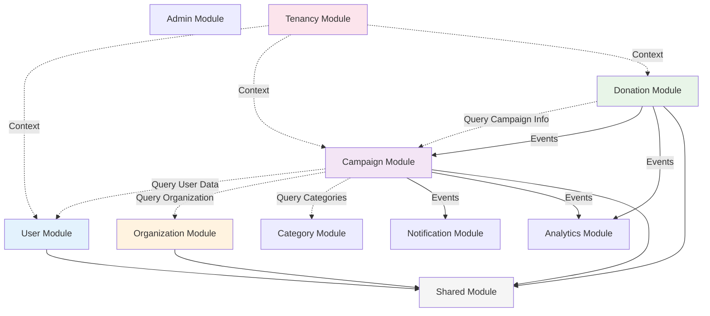
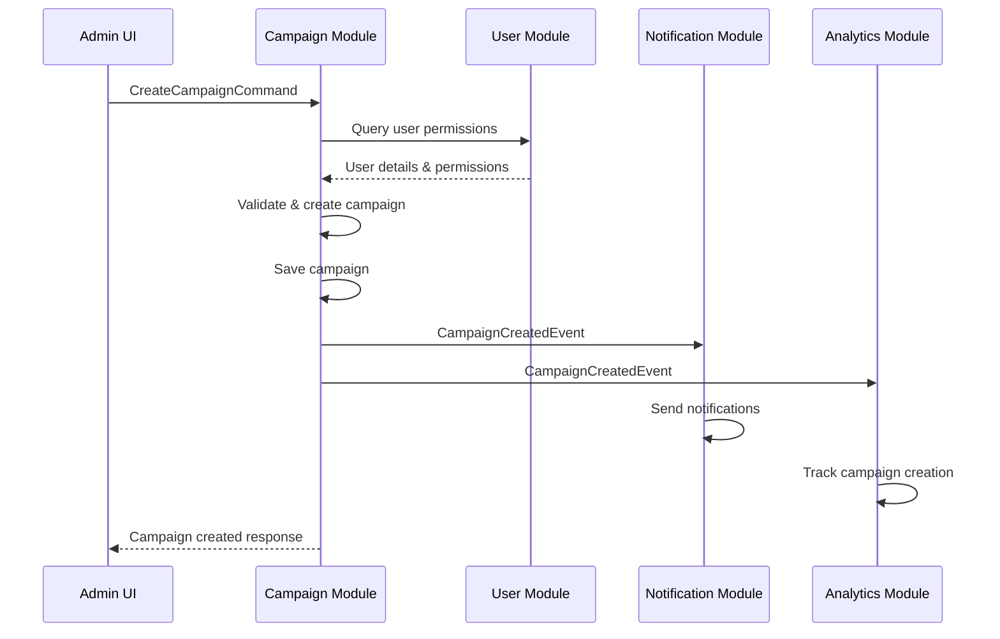
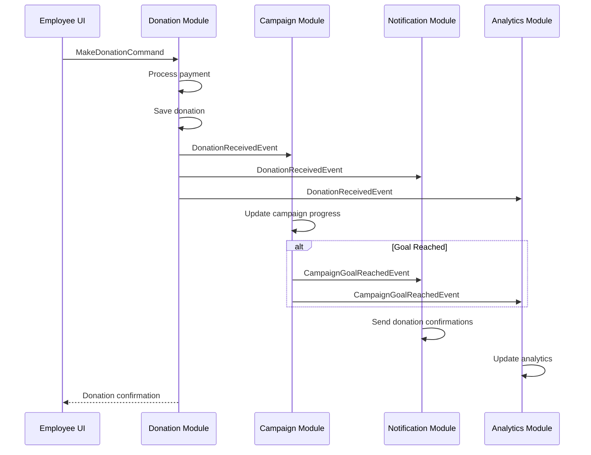
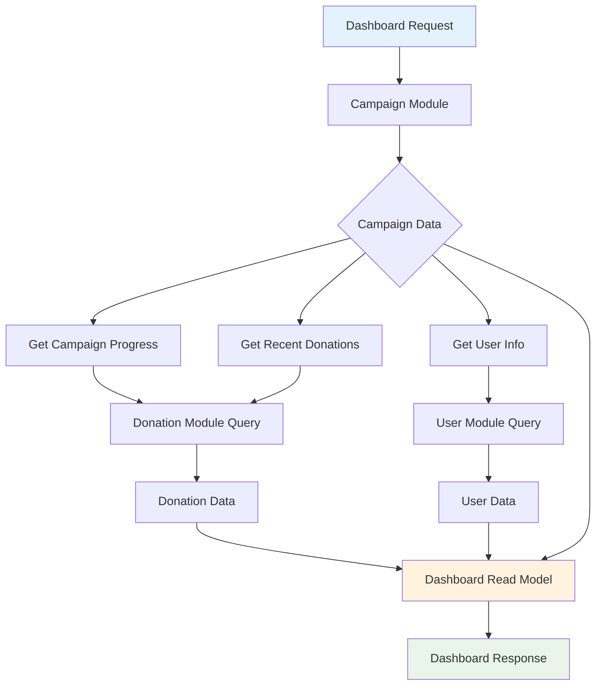
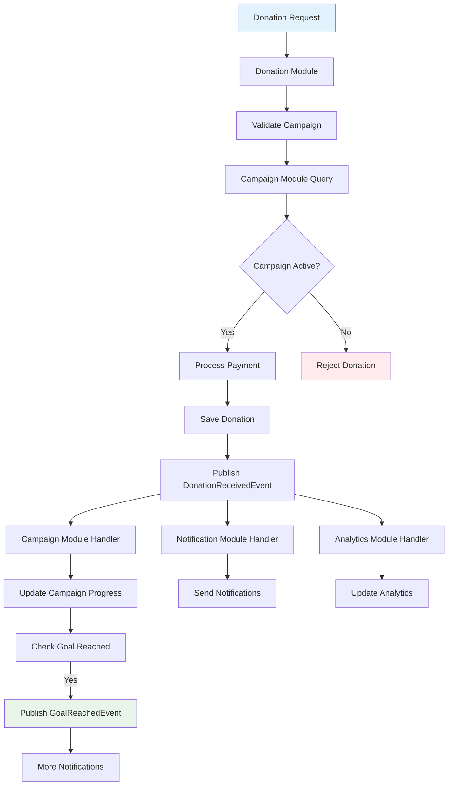

# Module Interactions and Dependencies

This document provides a comprehensive overview of how modules interact with each other in the ACME Corp CSR Platform, including dependency management, communication patterns, and integration strategies.

## Table of Contents

1. [Module Dependency Map](#module-dependency-map)
2. [Communication Patterns](#communication-patterns)
3. [Event-Driven Architecture](#event-driven-architecture)
4. [Query-Based Integration](#query-based-integration)
5. [Shared Kernel](#shared-kernel)
6. [Module Integration Examples](#module-integration-examples)
7. [Dependency Management](#dependency-management)
8. [API Mapping](#api-mapping)
9. [Data Flow Diagrams](#data-flow-diagrams)
10. [Integration Best Practices](#integration-best-practices)

## Module Dependency Map

### High-Level Module Overview



### Detailed Dependency Matrix

| Module | Depends On | Communication Type | Purpose |
|--------|------------|-------------------|---------|
| **User** | Shared | Direct | Common value objects |
| **Campaign** | User, Organization, Category, Shared | Query + Events | User validation, org context |
| **Donation** | Campaign, User, Shared | Query + Events | Campaign updates, user verification |
| **Organization** | User, Shared | Query | User-organization relationships |
| **Category** | Shared | Direct | Common value objects |
| **Notification** | User, Campaign, Donation | Events Only | Cross-module notifications |
| **Analytics** | Campaign, Donation, User | Events Only | Data aggregation |
| **Admin** | All Modules | Query + Commands | Administrative operations |
| **Tenancy** | None | Context Provider | Multi-tenant data isolation |

## Communication Patterns

### 1. Event-Driven Communication (Preferred)

Events are the primary mechanism for cross-module communication, ensuring loose coupling.

```php
// Campaign Module publishes event
class CampaignCreatedEvent implements DomainEventInterface {
    public function __construct(
        public readonly CampaignId $campaignId,
        public readonly string $campaignName,
        public readonly UserId $createdBy,
        public readonly OrganizationId $organizationId
    ) {}
}

// Notification Module listens and reacts
class SendCampaignCreatedNotificationHandler {
    public function __construct(
        private NotificationServiceInterface $notificationService,
        private FindUserQueryInterface $userQuery
    ) {}
    
    public function __invoke(CampaignCreatedEvent $event): void {
        $user = $this->userQuery->findById($event->createdBy);
        
        $this->notificationService->sendNotification(
            userId: $event->createdBy,
            type: NotificationType::CAMPAIGN_CREATED,
            data: [
                'campaign_name' => $event->campaignName,
                'campaign_id' => $event->campaignId->toString()
            ]
        );
    }
}

// Analytics Module also listens
class TrackCampaignCreationHandler {
    public function __invoke(CampaignCreatedEvent $event): void {
        $this->analyticsService->track('campaign_created', [
            'campaign_id' => $event->campaignId->toString(),
            'organization_id' => $event->organizationId->toString(),
            'created_at' => $event->getOccurredOn()
        ]);
    }
}
```

### 2. Query-Based Integration

Modules can query data from other modules through well-defined interfaces.

```php
// User Module provides query interface
interface FindUserQueryInterface {
    public function findById(UserId $id): ?UserReadModel;
    public function findByIds(array $userIds): array;
    public function findActiveByOrganization(OrganizationId $orgId): array;
}

// Campaign Module uses the interface
class CreateCampaignCommandHandler {
    public function __construct(
        private CampaignRepositoryInterface $campaignRepository,
        private FindUserQueryInterface $userQuery,
        private EventDispatcherInterface $eventDispatcher
    ) {}
    
    public function __invoke(CreateCampaignCommand $command): Campaign {
        // Validate user can create campaigns
        $user = $this->userQuery->findById($command->createdBy);
        if (!$user || !$user->canCreateCampaigns()) {
            throw new InsufficientPermissionsException();
        }
        
        // Create campaign with validated user
        $campaign = Campaign::create(/* ... */);
        $this->campaignRepository->save($campaign);
        
        // Publish event for other modules
        $this->eventDispatcher->dispatch(
            new CampaignCreatedEvent(
                $campaign->getId(),
                $campaign->getName(),
                $command->createdBy,
                $command->organizationId
            )
        );
        
        return $campaign;
    }
}
```

### 3. Shared Kernel Pattern

Common domain concepts are shared through the Shared module.

```php
// Shared Module - Common Value Objects
namespace Modules\Shared\Domain\ValueObject;

final readonly class Money {
    public function __construct(
        private int $amount, // In cents
        private string $currency
    ) {}
    
    // Used across Campaign, Donation, and other modules
}

final readonly class UserId {
    public function __construct(private string $value) {}
    
    // Shared identifier type across all modules
}
```

## Event-Driven Architecture

### Core Events and Their Subscribers

#### Campaign Events

```php
// Campaign Module Events
class CampaignCreatedEvent {
    // Subscribers: Notification, Analytics
}

class CampaignGoalReachedEvent {
    // Subscribers: Notification, Analytics, Organization (for reporting)
}

class CampaignClosedEvent {
    // Subscribers: Notification, Analytics, Donation (prevent new donations)
}

class CampaignUpdatedEvent {
    // Subscribers: Analytics (for change tracking)
}
```

#### Donation Events

```php
// Donation Module Events
class DonationReceivedEvent {
    public function __construct(
        public readonly DonationId $donationId,
        public readonly CampaignId $campaignId,
        public readonly UserId $donorId,
        public readonly Money $amount
    ) {}
    
    // Subscribers: Campaign (update progress), Analytics, Notification
}

class DonationRefundedEvent {
    // Subscribers: Campaign (adjust progress), Analytics, Notification
}

class PaymentFailedEvent {
    // Subscribers: Notification, Analytics
}
```

#### User Events

```php
// User Module Events
class UserCreatedEvent {
    // Subscribers: Notification (welcome email), Analytics
}

class UserActivatedEvent {
    // Subscribers: Notification, Analytics
}

class UserPermissionsChangedEvent {
    // Subscribers: Campaign (revalidate permissions), Analytics
}
```

### Event Flow Diagrams

#### Campaign Creation Flow



#### Donation Processing Flow



## Query-Based Integration

### Query Interface Definitions

Each module exposes query interfaces for other modules to use:

```php
// User Module Query Interfaces
interface FindUserQueryInterface {
    public function findById(UserId $id): ?UserReadModel;
    public function findActiveByRole(UserRole $role): array;
}

interface UserPermissionQueryInterface {
    public function canCreateCampaigns(UserId $id): bool;
    public function canMakeDonations(UserId $id): bool;
}

// Campaign Module Query Interfaces
interface FindCampaignQueryInterface {
    public function findById(CampaignId $id): ?CampaignReadModel;
    public function findActiveByOrganization(OrganizationId $orgId): array;
}

interface CampaignStatsQueryInterface {
    public function getCampaignProgress(CampaignId $id): CampaignProgressReadModel;
    public function getTotalRaised(CampaignId $id): Money;
}

// Organization Module Query Interfaces
interface FindOrganizationQueryInterface {
    public function findById(OrganizationId $id): ?OrganizationReadModel;
    public function findByUser(UserId $userId): ?OrganizationReadModel;
}
```

### Query Handler Implementations

```php
// User Module - Query Handler Implementation
final readonly class FindUserQueryHandler implements FindUserQueryInterface {
    public function __construct(
        private UserRepositoryInterface $userRepository
    ) {}
    
    public function findById(UserId $id): ?UserReadModel {
        $user = $this->userRepository->findById($id);
        
        if (!$user) {
            return null;
        }
        
        return new UserReadModel(
            id: $user->getId()->toString(),
            name: $user->getFullName(),
            email: $user->getEmailString(),
            role: $user->getRole()->value,
            canCreateCampaigns: $user->canCreateCampaigns(),
            canMakeDonations: $user->canMakeDonations()
        );
    }
}

// Campaign Module - Using User Query
final readonly class ValidateCampaignCreatorService {
    public function __construct(
        private FindUserQueryInterface $userQuery,
        private UserPermissionQueryInterface $permissionQuery
    ) {}
    
    public function validate(UserId $userId): void {
        $user = $this->userQuery->findById($userId);
        
        if (!$user) {
            throw new UserNotFoundException($userId);
        }
        
        if (!$this->permissionQuery->canCreateCampaigns($userId)) {
            throw new InsufficientPermissionsException(
                'User cannot create campaigns'
            );
        }
    }
}
```

## Shared Kernel

### Common Domain Concepts

The Shared module contains domain concepts used across multiple modules:

```php
// modules/Shared/Domain/ValueObject/Money.php
final readonly class Money {
    private function __construct(
        private int $amount, // Stored in cents
        private string $currency
    ) {}
    
    public static function euros(float $amount): self;
    public static function zero(string $currency): self;
    public function add(self $other): self;
    public function subtract(self $other): self;
    public function isGreaterThan(self $other): bool;
    // Used in: Campaign (goals), Donation (amounts), Budget (limits)
}

// modules/Shared/Domain/ValueObject/UserId.php
final readonly class UserId {
    public function __construct(private string $value) {}
    
    public static function fromString(string $value): self;
    public function toString(): string;
    // Used across: All modules for user references
}

// modules/Shared/Domain/ValueObject/DateRange.php
final readonly class DateRange {
    public function __construct(
        private DateTimeImmutable $start,
        private DateTimeImmutable $end
    ) {}
    
    public function contains(DateTimeImmutable $date): bool;
    public function overlaps(self $other): bool;
    // Used in: Campaign (duration), Analytics (reporting periods)
}
```

### Shared Interfaces

```php
// modules/Shared/Domain/Event/DomainEventInterface.php
interface DomainEventInterface {
    public function getAggregateId(): string;
    public function getEventName(): string;
    public function getOccurredOn(): DateTimeImmutable;
}

// modules/Shared/Application/Command/CommandInterface.php
interface CommandInterface {
    // Marker interface for commands
}

// modules/Shared/Application/Query/QueryInterface.php
interface QueryInterface {
    // Marker interface for queries
}
```

## Module Integration Examples

### Campaign-Donation Integration

When a donation is made to a campaign, multiple interactions occur:

```php
// 1. Donation Module validates campaign
class MakeDonationCommandHandler {
    public function __construct(
        private FindCampaignQueryInterface $campaignQuery,
        private DonationRepositoryInterface $donationRepository,
        private PaymentServiceInterface $paymentService,
        private EventDispatcherInterface $eventDispatcher
    ) {}
    
    public function __invoke(MakeDonationCommand $command): Donation {
        // Query campaign to validate donation
        $campaign = $this->campaignQuery->findById($command->campaignId);
        
        if (!$campaign || !$campaign->canReceiveDonations()) {
            throw new CampaignNotAcceptingDonationsException();
        }
        
        // Process donation
        $donation = Donation::create(/* ... */);
        $paymentResult = $this->paymentService->process($donation);
        
        if ($paymentResult->isSuccessful()) {
            $this->donationRepository->save($donation);
            
            // Notify Campaign module via event
            $this->eventDispatcher->dispatch(
                new DonationReceivedEvent(
                    $donation->getId(),
                    $command->campaignId,
                    $command->donorId,
                    $donation->getAmount()
                )
            );
        }
        
        return $donation;
    }
}

// 2. Campaign Module updates progress
class UpdateCampaignProgressHandler {
    public function __invoke(DonationReceivedEvent $event): void {
        $campaign = $this->campaignRepository->findById($event->campaignId);
        
        if (!$campaign) {
            return; // Campaign may have been deleted
        }
        
        $result = $campaign->acceptDonation($event->amount);
        
        if ($result->wasAccepted()) {
            $this->campaignRepository->save($campaign);
            
            // Check if goal was reached
            if ($campaign->isGoalReached()) {
                $this->eventDispatcher->dispatch(
                    new CampaignGoalReachedEvent(
                        $campaign->getId(),
                        $campaign->getTotalRaised()
                    )
                );
            }
        }
    }
}
```

### User-Campaign Permission Validation

```php
// Campaign Module validates user permissions before creation
class CreateCampaignCommandHandler {
    public function __construct(
        private UserPermissionQueryInterface $userPermissions,
        private FindOrganizationQueryInterface $organizationQuery,
        private CampaignRepositoryInterface $campaignRepository
    ) {}
    
    public function __invoke(CreateCampaignCommand $command): Campaign {
        // 1. Validate user permissions (User Module)
        if (!$this->userPermissions->canCreateCampaigns($command->createdBy)) {
            throw new InsufficientPermissionsException();
        }
        
        // 2. Validate organization context (Organization Module)
        $organization = $this->organizationQuery->findById($command->organizationId);
        if (!$organization || !$organization->isActive()) {
            throw new OrganizationNotActiveException();
        }
        
        // 3. Create campaign
        $campaign = Campaign::create(/* ... */);
        $this->campaignRepository->save($campaign);
        
        return $campaign;
    }
}
```

## Dependency Management

### Service Provider Configuration

Each module's service provider manages its own dependencies and cross-module interfaces:

```php
// Campaign Module Service Provider
class CampaignServiceProvider extends ServiceProvider {
    public function register(): void {
        // Internal dependencies
        $this->app->bind(
            CampaignRepositoryInterface::class,
            CampaignEloquentRepository::class
        );
        
        // Cross-module query interfaces (provided by other modules)
        // These are bound by the modules that implement them
        
        // Command handlers
        $this->app->bind(CreateCampaignCommandHandler::class);
        $this->app->bind(UpdateCampaignProgressHandler::class);
        
        // Query handlers
        $this->app->bind(FindCampaignQueryHandler::class);
        
        // Provide query interface for other modules
        $this->app->bind(
            FindCampaignQueryInterface::class,
            FindCampaignQueryHandler::class
        );
    }
    
    public function boot(): void {
        // Register event listeners
        Event::listen(
            DonationReceivedEvent::class,
            UpdateCampaignProgressHandler::class
        );
        
        Event::listen(
            CampaignGoalReachedEvent::class,
            [
                NotifyGoalReachedHandler::class,      // Notification module
                TrackGoalReachedHandler::class        // Analytics module
            ]
        );
    }
}
```

### Dependency Injection Configuration

```php
// User Module - Provides interfaces for other modules
class UserServiceProvider extends ServiceProvider {
    public function register(): void {
        // ... internal bindings
        
        // Provide interfaces for other modules to use
        $this->app->bind(
            FindUserQueryInterface::class,
            FindUserQueryHandler::class
        );
        
        $this->app->bind(
            UserPermissionQueryInterface::class,
            UserPermissionQueryHandler::class
        );
    }
}

// Campaign Module - Consumes User interfaces
class CreateCampaignController {
    public function __construct(
        private CommandBusInterface $commandBus,
        private FindUserQueryInterface $userQuery // Injected from User module
    ) {}
}
```

## API Mapping

### Module API Endpoints

Each module exposes its own API endpoints while coordinating for complex operations:

```http
# User Module APIs
GET    /api/users/{id}                 # Get user details
PUT    /api/users/{id}                 # Update user
POST   /api/users/{id}/permissions     # Update permissions

# Campaign Module APIs  
POST   /api/campaigns                  # Create campaign
GET    /api/campaigns                  # List campaigns
GET    /api/campaigns/{id}            # Get campaign details
PUT    /api/campaigns/{id}            # Update campaign
POST   /api/campaigns/{id}/close      # Close campaign

# Donation Module APIs
POST   /api/donations                  # Make donation
GET    /api/donations                  # List donations
GET    /api/donations/{id}            # Get donation details
POST   /api/donations/{id}/refund     # Refund donation

# Organization Module APIs
GET    /api/organizations             # List organizations
GET    /api/organizations/{id}        # Get organization details
PUT    /api/organizations/{id}        # Update organization
```

### Cross-Module API Operations

Some API operations involve multiple modules:

```php
// Campaign Creation API - Involves User and Organization validation
class CreateCampaignController {
    public function __invoke(CreateCampaignRequest $request): JsonResponse {
        // The command handler will:
        // 1. Validate user permissions (User Module)
        // 2. Validate organization (Organization Module)  
        // 3. Create campaign (Campaign Module)
        // 4. Send notifications (via events to Notification Module)
        
        $command = new CreateCampaignCommand(
            name: $request->validated('name'),
            description: $request->validated('description'),
            goalAmount: $request->validated('goal_amount'),
            currency: $request->validated('currency'),
            createdBy: UserId::fromString($request->user()->id),
            organizationId: OrganizationId::fromString($request->validated('organization_id'))
        );
        
        $campaign = $this->commandBus->dispatch($command);
        
        return new JsonResponse([
            'data' => ['id' => $campaign->getId()->toString()]
        ], 201);
    }
}
```

## Data Flow Diagrams

### Campaign Dashboard Data Flow



### Donation Processing Data Flow



## Integration Best Practices

### 1. Favor Events Over Direct Calls

```php
// Avoid: Direct module dependencies
class CampaignService {
    public function __construct(
        private NotificationService $notificationService // Direct dependency
    ) {}
    
    public function createCampaign(CreateCampaignCommand $command): Campaign {
        $campaign = Campaign::create(/* ... */);
        
        // Direct call to another module
        $this->notificationService->sendCampaignCreatedNotification($campaign);
        
        return $campaign;
    }
}

// Prefer: Event-driven communication
class CreateCampaignCommandHandler {
    public function __construct(
        private EventDispatcherInterface $eventDispatcher // Framework abstraction
    ) {}
    
    public function __invoke(CreateCampaignCommand $command): Campaign {
        $campaign = Campaign::create(/* ... */);
        
        // Publish event - let other modules decide how to react
        $this->eventDispatcher->dispatch(
            new CampaignCreatedEvent($campaign->getId(), $campaign->getName())
        );
        
        return $campaign;
    }
}
```

### 2. Use Query Interfaces for Read Operations

```php
// Define clear query interfaces
interface FindUserQueryInterface {
    public function findById(UserId $id): ?UserReadModel;
    public function canCreateCampaigns(UserId $id): bool;
}

// Use interfaces in dependent modules
class CreateCampaignCommandHandler {
    public function __construct(
        private FindUserQueryInterface $userQuery // Interface, not implementation
    ) {}
}
```

### 3. Keep Events Focused and Immutable

```php
// Good: Focused, immutable event
final readonly class CampaignGoalReachedEvent implements DomainEventInterface {
    public function __construct(
        public CampaignId $campaignId,
        public Money $finalAmount,
        public DateTimeImmutable $reachedAt
    ) {}
}

// Avoid: Exposing full domain objects in events
class CampaignGoalReachedEvent {
    public function __construct(
        public Campaign $campaign // Exposes internal structure
    ) {}
}
```

### 4. Handle Event Failures Gracefully

```php
class SendGoalReachedNotificationHandler {
    public function __invoke(CampaignGoalReachedEvent $event): void {
        try {
            $campaign = $this->campaignQuery->findById($event->campaignId);
            
            if (!$campaign) {
                // Handle gracefully - campaign might have been deleted
                $this->logger->warning('Campaign not found for goal reached notification', [
                    'campaign_id' => $event->campaignId->toString()
                ]);
                return;
            }
            
            $this->notificationService->sendGoalReachedNotification($campaign);
            
        } catch (Exception $e) {
            // Log but don't fail the entire process
            $this->logger->error('Failed to send goal reached notification', [
                'campaign_id' => $event->campaignId->toString(),
                'error' => $e->getMessage()
            ]);
        }
    }
}
```

### 5. Use Read Models for Cross-Module Data

```php
// Return read models, not domain objects
interface FindCampaignQueryInterface {
    public function findById(CampaignId $id): ?CampaignReadModel; // Read model
}

final readonly class CampaignReadModel {
    public function __construct(
        public string $id,
        public string $name,
        public string $status,
        public bool $canReceiveDonations,
        public Money $goal,
        public Money $raised
    ) {}
}

// Avoid: Exposing domain objects
interface FindCampaignQueryInterface {
    public function findById(CampaignId $id): ?Campaign; // Domain object
}
```

### 6. Version Your Events

```php
// Version events for backward compatibility
final readonly class CampaignCreatedEventV1 implements DomainEventInterface {
    public function getEventName(): string {
        return 'campaign.created.v1';
    }
}

// When adding fields, create new version
final readonly class CampaignCreatedEventV2 implements DomainEventInterface {
    public function __construct(
        public CampaignId $campaignId,
        public string $campaignName,
        public UserId $createdBy,
        public ?CategoryId $categoryId = null // New field
    ) {}
    
    public function getEventName(): string {
        return 'campaign.created.v2';
    }
}
```

## Monitoring and Observability

### Event Tracking

```php
class EventLogger {
    public function handle(DomainEventInterface $event): void {
        $this->logger->info('Domain event dispatched', [
            'event_name' => $event->getEventName(),
            'aggregate_id' => $event->getAggregateId(),
            'occurred_on' => $event->getOccurredOn()->format('c'),
            'module' => $this->getModuleFromEvent($event)
        ]);
    }
}

// Track cross-module communication
class CrossModuleQueryLogger {
    public function logQuery(string $fromModule, string $queryInterface, array $parameters): void {
        $this->logger->debug('Cross-module query', [
            'from_module' => $fromModule,
            'query_interface' => $queryInterface,
            'parameters' => $parameters,
            'timestamp' => now()->format('c')
        ]);
    }
}
```

## References

- [Hexagonal Architecture](./hexagonal-architecture.md) - Core architecture patterns
- [Module Structure Guide](./module-structure.md) - Individual module organization
- [API Platform Design](./api-platform-design.md) - API layer integration
- [Developer Guide](../development/developer-guide.md)
- [User Module](../../modules/User/) - Reference implementation
- [Domain-Driven Design by Eric Evans](https://domainlanguage.com/ddd/)
- [Implementing Domain-Driven Design by Vaughn Vernon](https://vaughnvernon.com/)

---

**Developed and Maintained by Go2digit.al**

Specialized in enterprise-grade applications with focus on scalability, security, and maintainability.

Copyright 2025 Go2digit.al - All Rights Reserved
