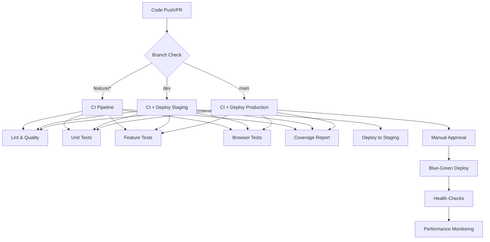

#  CI/CD Pipeline Documentation

## Overview

The ACME Corp CSR Platform uses a comprehensive CI/CD pipeline built with GitHub Actions to ensure code quality, security, and reliable deployments.

## Pipeline Architecture



## Workflows

### 1.  CI Pipeline (`ci.yml`)

**Triggers:**
- Push to `dev`, `main`, `feature/*`, `hotfix/*`
- Pull requests to `dev`, `main`

**Jobs:**
- **Lint & Quality**: Code style (Pint), static analysis (PHPStan), architecture (Deptrac), refactoring (Rector)
- **Unit & Feature Tests**: Comprehensive test suite with MySQL and Redis
- **Coverage Analysis**: Test coverage with 80% minimum threshold
- **Browser Tests**: Pest Browser Plugin for critical user flows

**Environment Setup:**
- PHP 8.4 with extensions (mysql, redis, opcache, etc.)
- Node.js 20 with npm caching
- MySQL 8.0 and Redis 7 services
- Parallel test execution for performance

### 2.  Deployment Pipeline (`deploy.yml`)

**Triggers:**
- Push to `dev` (staging deployment)
- Push to `main` (production deployment)  
- Manual workflow dispatch

**Environments:**
- **Staging**: `https://staging.yourdomain.com`
- **Production**: `https://yourdomain.com`

**Deployment Strategy:**
- **Staging**: Direct deployment with immediate verification
- **Production**: Blue-green deployment with manual approval

**Security Features:**
- Multi-approver requirement for production
- Comprehensive health checks
- Automatic rollback capability
- Performance verification


## Configuration

### Environment Variables

```env
# CI/CD Secrets (GitHub Secrets)
CODECOV_TOKEN=xxx
STAGING_HOST=xxx
STAGING_USER=xxx
STAGING_SSH_KEY=xxx
PRODUCTION_HOST=xxx
PRODUCTION_USER=xxx
PRODUCTION_SSH_KEY=xxx
PRODUCTION_APPROVERS=user1,user2

# Application Configuration
PHP_VERSION=8.4
NODE_VERSION=20
DB_CONNECTION=mysql
REDIS_HOST=redis
CACHE_DRIVER=redis
SESSION_DRIVER=redis
```

### Caching Strategy

**Composer Dependencies:**
- Cache key: `composer-${{ hashFiles('**/composer.lock') }}`
- Improves build time by ~2-3 minutes

**npm Dependencies:**
- Cache key: `npm-${{ hashFiles('**/package-lock.json') }}`
- Improves build time by ~1-2 minutes

**Docker Layers:**
- Multi-stage builds for optimized production images
- Layer caching for development environments

### Test Database Configuration

**MySQL Service:**
```yaml
mysql:
  image: mysql:8.0
  env:
    MYSQL_ROOT_PASSWORD: # Set in CI environment
    MYSQL_DATABASE: testing
    MYSQL_USER: user
    MYSQL_PASSWORD: # Set in CI environment
  options: --health-cmd="mysqladmin ping --silent"
```

**Redis Service:**
```yaml
redis:
  image: redis:7-alpine
  options: --health-cmd="redis-cli ping"
```

## Quality Gates

### Code Quality Requirements

1. **Laravel Pint**: PSR-12 compliance
2. **PHPStan**: Level 8 static analysis
3. **Rector**: Modern PHP practices
4. **Deptrac**: Hexagonal architecture compliance
5. **ESLint**: JavaScript/TypeScript standards

### Test Coverage Requirements

- **Minimum Coverage**: 80%
- **Fail on Drop**: Yes
- **Coverage Reports**: Codecov integration
- **Formats**: HTML, Clover XML, Text

### Security Requirements

- **No High/Critical Vulnerabilities**: Dependencies must be secure
- **No Secrets**: Source code must not contain secrets
- **Container Security**: Docker images must pass security scans
- **SAST Clean**: Static analysis must not find security issues

### Performance Requirements

- **Homepage Load**: < 2 seconds (95th percentile)
- **API Response**: < 1 second (95th percentile)
- **Error Rate**: < 1% under normal load
- **Lighthouse Score**: > 80 for performance

## Docker Configuration

### Multi-Stage Dockerfile

**Stages:**
1. **Builder**: Install dependencies, build assets
2. **Production**: Optimized runtime with Nginx + PHP-FPM
3. **Testing**: Full environment for CI/CD
4. **Development**: Local development with Xdebug

**Optimization Features:**
- OPcache with preloading
- Nginx with gzip compression
- Supervisor for process management
- Health checks for monitoring

### Docker Compose Profiles

```bash
# Production
docker-compose up

# Development  
docker-compose --profile dev up

# Testing
docker-compose --profile test up
```

## Monitoring & Observability

### Health Checks

**Application Level:**
- Database connectivity
- Redis connectivity  
- Disk space usage
- Memory usage
- Service status

**Infrastructure Level:**
- Container health
- Load balancer status
- SSL certificate validity
- DNS resolution

### Performance Monitoring

**Metrics Collected:**
- Response times (p50, p95, p99)
- Request rates
- Error rates
- Memory usage
- CPU utilization
- Database query performance

**Alerting:**
- Performance degradation > 2x baseline
- Error rate > 5%
- Disk usage > 90%
- Memory usage > 90%

## Deployment Strategies

### Blue-Green Deployment

**Process:**
1. Deploy to inactive environment (blue/green)
2. Run health checks and smoke tests
3. Switch traffic to new environment
4. Monitor for issues
5. Rollback if problems detected

**Benefits:**
- Zero downtime deployments
- Instant rollback capability
- Safe production deployments
- A/B testing capability

### Rollback Procedures

**Automatic Rollback Triggers:**
- Health check failures
- Error rate > 10%
- Performance degradation > 5x

**Manual Rollback:**
```bash
# Emergency rollback workflow
gh workflow run deploy.yml -f environment=rollback
```

## Best Practices

### Branch Strategy

```
main (production)
├── dev (staging)
├── feature/epic-name
├── hotfix/critical-fix
└── release/v1.2.3
```

### Commit Guidelines

**Format:** `type(scope): description`

**Types:**
- `feat`: New features
- `fix`: Bug fixes  
- `docs`: Documentation
- `style`: Code formatting
- `refactor`: Code refactoring
- `test`: Test additions
- `chore`: Maintenance

### Pull Request Process

1. **Create feature branch** from `dev`
2. **Implement changes** with tests
3. **Run local quality checks**
4. **Create pull request** to `dev`
5. **CI pipeline runs** automatically
6. **Code review** by team members
7. **Merge after approval** and CI success

### Security Considerations

**Secrets Management:**
- Use GitHub Secrets for sensitive data
- Rotate secrets regularly
- Never commit secrets to code
- Use environment-specific secrets

**Access Controls:**
- Required reviewers for production
- Branch protection rules
- Signed commits (recommended)
- Two-factor authentication

## Troubleshooting

### Common Issues

**Build Failures:**
```bash
# Clear caches
composer clear-cache
npm cache clean --force

# Rebuild dependencies  
rm -rf vendor node_modules
composer install
npm ci
```

**Test Failures:**
```bash
# Run specific test suite
./vendor/bin/pest --testsuite=Unit
./vendor/bin/pest --testsuite=Feature
./vendor/bin/pest --testsuite=Integration
./vendor/bin/pest --coverage

# Debug failing tests
./vendor/bin/pest --stop-on-failure -vvv
```

**Deployment Issues:**
```bash
# Check deployment logs
gh run list --workflow=deploy.yml
gh run view [RUN_ID]

# Manual deployment
gh workflow run deploy.yml -f environment=staging
```

### Performance Debugging

**Identify Bottlenecks:**
```bash
# Database queries
php artisan telescope:install

# Application profiling  
php artisan route:list
php artisan config:cache
php artisan route:cache

# Memory usage
composer require --dev barryvdh/laravel-debugbar
```

## Metrics & KPIs

### Build Performance

- **Average build time**: < 15 minutes
- **Cache hit rate**: > 80%
- **Test execution time**: < 10 minutes
- **Deployment time**: < 5 minutes

### Quality Metrics

- **Code coverage**: > 80%
- **PHPStan level**: 8 (maximum)
- **Security scan**: 0 high/critical issues
- **Performance score**: > 80 (Lighthouse)

### Reliability Metrics

- **Deployment success rate**: > 95%
- **Mean time to recovery**: < 30 minutes
- **False positive rate**: < 5%
- **Pipeline uptime**: > 99%

## Future Enhancements

### Planned Improvements

1. **Progressive Deployment**: Canary releases
2. **Feature Flags**: Runtime feature toggles
3. **Synthetic Monitoring**: Continuous availability testing
4. **Infrastructure as Code**: Terraform/Pulumi
5. **Advanced Security**: DAST, dependency tracking
6. **ML-Powered Testing**: Intelligent test selection

### Integration Roadmap

- **Monitoring**: New Relic, DataDog
- **Error Tracking**: Sentry, Rollbar  
- **APM**: Application performance monitoring
- **Log Management**: ELK Stack
- **Notification**: Email notifications
- **Documentation**: Auto-generated API docs

---

For questions or support with the CI/CD pipeline, contact info@go2digit.al.

---

**Developed and Maintained by Go2digit.al**

Specialized in enterprise-grade applications with focus on scalability, security, and maintainability.

Copyright 2025 Go2digit.al - All Rights Reserved
