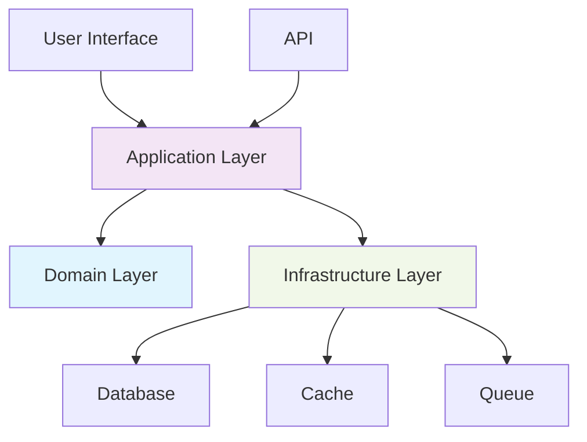

# Go2digit.al ACME Corp CSR Platform - Developer Guide

This comprehensive guide explains how to develop features using the hexagonal architecture principles adopted in the Go2digit.al ACME Corp CSR Platform.

## Table of Contents

1. [Architecture Overview](#architecture-overview)
2. [Development Workflow](#development-workflow)
3. [Creating Domain Models](#creating-domain-models)
4. [Implementing CQRS](#implementing-cqrs)
5. [Building Infrastructure](#building-infrastructure)
6. [Testing Strategy](#testing-strategy)
7. [Code Examples](#code-examples)
8. [Common Patterns](#common-patterns)
9. [Best Practices](#best-practices)
10. [Troubleshooting](#troubleshooting)

## Architecture Overview

The ACME Corp CSR Platform follows hexagonal architecture with three distinct layers:



### Layer Responsibilities

- **Domain (Blue)**: Pure business logic, no external dependencies
- **Application (Purple)**: Use case orchestration, CQRS handlers
- **Infrastructure (Green)**: External integrations, framework code

## Development Workflow

### 1. Feature Planning
Before implementing a feature, identify:

```php
// Example: Adding Campaign Budget Feature
Domain Concepts:
- Budget (Value Object)
- BudgetLimit (Domain Rule)
- BudgetExceededException (Domain Exception)

Use Cases:
- Set Campaign Budget (Command)
- Check Budget Remaining (Query)
- Update Budget Usage (Command)

Infrastructure Needs:
- Database migration
- API endpoints
- Admin interface
```

### 2. Domain-First Development

Start with the domain layer and work outward:

```php
// 1. Define Value Objects
final readonly class Budget {
    public function __construct(
        private Money $limit,
        private Money $spent
    ) {
        if ($spent->isGreaterThan($limit)) {
            throw new BudgetExceededException();
        }
    }
    
    public function canSpend(Money $amount): bool {
        return $this->remaining()->isGreaterThanOrEqual($amount);
    }
    
    public function remaining(): Money {
        return $this->limit->subtract($this->spent);
    }
}

// 2. Enhance Domain Models
final class Campaign {
    private ?Budget $budget = null;
    
    public function setBudget(Budget $budget): void {
        $this->budget = $budget;
    }
    
    public function acceptDonation(Money $amount): DonationResult {
        if ($this->budget && !$this->budget->canSpend($amount)) {
            return DonationResult::rejected('Budget exceeded');
        }
        
        // ... existing logic
    }
}
```

### 3. Application Layer Implementation

Create commands, queries, and handlers:

```php
// Command for budget updates
final readonly class SetCampaignBudgetCommand implements CommandInterface {
    public function __construct(
        public CampaignId $campaignId,
        public float $budgetLimit,
        public string $currency
    ) {}
}

// Command handler with business logic orchestration
final readonly class SetCampaignBudgetCommandHandler {
    public function __construct(
        private CampaignRepositoryInterface $campaignRepository,
        private EventDispatcherInterface $eventDispatcher
    ) {}
    
    public function __invoke(SetCampaignBudgetCommand $command): void {
        $campaign = $this->campaignRepository->findById($command->campaignId);
        
        if (!$campaign) {
            throw new CampaignNotFoundException($command->campaignId);
        }
        
        $budget = new Budget(
            limit: Money::from($command->budgetLimit, $command->currency),
            spent: Money::zero($command->currency)
        );
        
        $campaign->setBudget($budget);
        $this->campaignRepository->save($campaign);
        
        $this->eventDispatcher->dispatch(
            new CampaignBudgetSetEvent($command->campaignId, $budget)
        );
    }
}
```

### 4. Infrastructure Implementation

Add controllers, repositories, and external adapters:

```php
// Single-action controller
final readonly class SetCampaignBudgetController {
    public function __construct(
        private CommandBusInterface $commandBus
    ) {}
    
    public function __invoke(
        string $campaignId,
        SetCampaignBudgetRequest $request
    ): JsonResponse {
        $command = new SetCampaignBudgetCommand(
            campaignId: CampaignId::fromString($campaignId),
            budgetLimit: $request->validated('budget_limit'),
            currency: $request->validated('currency')
        );
        
        $this->commandBus->dispatch($command);
        
        return new JsonResponse(['message' => 'Budget set successfully']);
    }
}
```

## Creating Domain Models

### Rich Domain Models

Domain models should contain business logic, not just data:

```php
// Anemic Domain Model (Avoid)
final class Campaign {
    public function __construct(
        private string $name,
        private Money $goal,
        private CampaignStatus $status
    ) {}
    
    // Only getters and setters - no business logic
    public function getName(): string { return $this->name; }
    public function setStatus(CampaignStatus $status): void { $this->status = $status; }
}

// Rich Domain Model (Preferred)
final class Campaign {
    public function __construct(
        private readonly CampaignId $id,
        private string $name,
        private Money $goal,
        private Money $raised,
        private CampaignStatus $status,
        private readonly DateTimeImmutable $createdAt
    ) {}
    
    // Business logic encapsulated in domain
    public function acceptDonation(Money $amount): DonationResult {
        if (!$this->status->isActive()) {
            return DonationResult::rejected('Campaign is not active');
        }
        
        if ($this->wouldExceedGoal($amount)) {
            return DonationResult::rejected('Donation would exceed goal');
        }
        
        $this->raised = $this->raised->add($amount);
        
        if ($this->hasReachedGoal()) {
            $this->status = CampaignStatus::completed();
        }
        
        return DonationResult::accepted($amount);
    }
    
    public function close(CampaignClosureReason $reason): void {
        if ($this->status->isClosed()) {
            throw new CampaignAlreadyClosedException($this->id);
        }
        
        $this->status = CampaignStatus::closed();
        // Domain event could be raised here
    }
    
    private function wouldExceedGoal(Money $amount): bool {
        return $this->raised->add($amount)->isGreaterThan($this->goal);
    }
    
    private function hasReachedGoal(): bool {
        return $this->raised->isGreaterThanOrEqual($this->goal);
    }
}
```

### Value Objects

Create value objects for domain concepts:

```php
// Money Value Object (already exists in Shared module)
final readonly class Money {
    private function __construct(
        private int $amount, // Store in cents
        private string $currency
    ) {}
    
    public static function euros(float $amount): self {
        return new self((int) round($amount * 100), 'EUR');
    }
    
    public function add(self $other): self {
        $this->ensureSameCurrency($other);
        return new self($this->amount + $other->amount, $this->currency);
    }
    
    public function isGreaterThan(self $other): bool {
        $this->ensureSameCurrency($other);
        return $this->amount > $other->amount;
    }
}

// Custom Value Object Example
final readonly class CampaignDescription {
    public function __construct(public string $value) {
        if (strlen($value) < 10) {
            throw new InvalidArgumentException('Description too short');
        }
        if (strlen($value) > 1000) {
            throw new InvalidArgumentException('Description too long');
        }
    }
    
    public function isLong(): bool {
        return strlen($this->value) > 500;
    }
}
```

### Domain Events

Use domain events for cross-module communication:

```php
// Domain Event
final readonly class CampaignGoalReachedEvent implements DomainEventInterface {
    public function __construct(
        public CampaignId $campaignId,
        public Money $finalAmount,
        public DateTimeImmutable $completedAt
    ) {}
    
    public function getAggregateId(): string {
        return $this->campaignId->toString();
    }
    
    public function getEventName(): string {
        return 'campaign.goal_reached';
    }
    
    public function getOccurredOn(): DateTimeImmutable {
        return $this->completedAt;
    }
}

// Event Handler (in Notification module)
final readonly class SendGoalReachedNotificationHandler {
    public function __construct(
        private NotificationServiceInterface $notificationService,
        private FindCampaignQueryInterface $campaignQuery
    ) {}
    
    public function __invoke(CampaignGoalReachedEvent $event): void {
        $campaign = $this->campaignQuery->findById($event->campaignId);
        
        if (!$campaign) {
            return; // Campaign may have been deleted
        }
        
        $this->notificationService->sendGoalReachedNotification($campaign);
    }
}
```

## Implementing CQRS

### Commands (Write Operations)

Commands represent intentions to change state:

```php
// Command - Immutable data container
final readonly class CreateCampaignCommand implements CommandInterface {
    public function __construct(
        public string $name,
        public string $description,
        public float $goalAmount,
        public string $currency,
        public UserId $createdBy,
        public OrganizationId $organizationId,
        public ?CategoryId $categoryId = null,
        public ?DateTimeImmutable $deadline = null
    ) {}
}

// Command Handler - Business logic orchestration
final readonly class CreateCampaignCommandHandler {
    public function __construct(
        private CampaignRepositoryInterface $campaignRepository,
        private FindUserQueryInterface $userQuery,
        private EventDispatcherInterface $eventDispatcher,
        private LoggerInterface $logger
    ) {}
    
    public function __invoke(CreateCampaignCommand $command): Campaign {
        // Validate user permissions
        $user = $this->userQuery->findById($command->createdBy);
        if (!$user || !$user->canCreateCampaigns()) {
            throw new InsufficientPermissionsException('User cannot create campaigns');
        }
        
        // Create domain object
        $campaign = Campaign::create(
            name: $command->name,
            description: new CampaignDescription($command->description),
            goal: Money::from($command->goalAmount, $command->currency),
            createdBy: $command->createdBy,
            organizationId: $command->organizationId,
            categoryId: $command->categoryId,
            deadline: $command->deadline
        );
        
        // Persist
        $this->campaignRepository->save($campaign);
        
        // Log for audit
        $this->logger->info('Campaign created', [
            'campaign_id' => $campaign->getId()->toString(),
            'created_by' => $command->createdBy->toString()
        ]);
        
        // Notify other modules
        $this->eventDispatcher->dispatch(
            new CampaignCreatedEvent(
                $campaign->getId(),
                $campaign->getName(),
                $command->createdBy
            )
        );
        
        return $campaign;
    }
}
```

### Queries (Read Operations)

Queries retrieve data without side effects:

```php
// Query - Request for data
final readonly class FindActiveCampaignsQuery implements QueryInterface {
    public function __construct(
        public int $page = 1,
        public int $limit = 20,
        public ?CategoryId $categoryId = null,
        public ?OrganizationId $organizationId = null,
        public ?string $searchTerm = null,
        public array $sortBy = ['created_at' => 'desc']
    ) {}
}

// Query Handler - Optimized data retrieval
final readonly class FindActiveCampaignsQueryHandler {
    public function __construct(
        private CampaignReadRepositoryInterface $readRepository
    ) {}
    
    public function __invoke(FindActiveCampaignsQuery $query): CampaignListReadModel {
        return $this->readRepository->findActiveCampaignsOptimized(
            page: $query->page,
            limit: $query->limit,
            filters: [
                'category_id' => $query->categoryId?->toString(),
                'organization_id' => $query->organizationId?->toString(),
                'search' => $query->searchTerm,
            ],
            sorting: $query->sortBy
        );
    }
}

// Read Model - Optimized for display
final readonly class CampaignListReadModel {
    public function __construct(
        /** @var CampaignListItemReadModel[] */
        public array $campaigns,
        public int $totalCount,
        public int $currentPage,
        public int $perPage,
        public bool $hasMore
    ) {}
}

final readonly class CampaignListItemReadModel {
    public function __construct(
        public string $id,
        public string $name,
        public string $description,
        public string $goalAmount,
        public string $raisedAmount,
        public string $currency,
        public float $progressPercentage,
        public string $status,
        public string $organizationName,
        public string $categoryName,
        public string $createdByName,
        public string $createdAt,
        public int $donorCount,
        public bool $isGoalReached
    ) {}
}
```

### Command/Query Bus Implementation

Use buses to decouple controllers from handlers:

```php
// Command Bus Interface
interface CommandBusInterface {
    public function dispatch(CommandInterface $command): mixed;
}

// Simple Bus Implementation
final readonly class SimpleCommandBus implements CommandBusInterface {
    public function __construct(
        private Container $container
    ) {}
    
    public function dispatch(CommandInterface $command): mixed {
        $handlerClass = str_replace('Command', 'CommandHandler', get_class($command));
        $handler = $this->container->make($handlerClass);
        
        return $handler($command);
    }
}

// Usage in Controller
final readonly class CreateCampaignController {
    public function __construct(
        private CommandBusInterface $commandBus
    ) {}
    
    public function __invoke(CreateCampaignRequest $request): JsonResponse {
        $command = new CreateCampaignCommand(...$request->validated());
        $campaign = $this->commandBus->dispatch($command);
        
        return new JsonResponse([
            'data' => ['id' => $campaign->getId()->toString()]
        ], 201);
    }
}
```

## Building Infrastructure

### Repository Implementation

Implement domain repository interfaces:

```php
// Domain Interface (in Domain layer)
interface CampaignRepositoryInterface {
    public function save(Campaign $campaign): void;
    public function findById(CampaignId $id): ?Campaign;
    public function delete(CampaignId $id): void;
}

// Eloquent Implementation (in Infrastructure layer)
final readonly class CampaignEloquentRepository implements CampaignRepositoryInterface {
    public function __construct(
        private CampaignEloquentModel $model
    ) {}
    
    public function save(Campaign $campaign): void {
        $eloquentModel = $this->model->firstOrNew([
            'id' => $campaign->getId()->toString()
        ]);
        
        $eloquentModel->fill([
            'id' => $campaign->getId()->toString(),
            'name' => $campaign->getName(),
            'description' => $campaign->getDescription()->value,
            'goal_amount' => $campaign->getGoal()->getAmountInCents(),
            'goal_currency' => $campaign->getGoal()->getCurrency(),
            'raised_amount' => $campaign->getRaised()->getAmountInCents(),
            'status' => $campaign->getStatus()->value,
            'created_by' => $campaign->getCreatedBy()->toString(),
            'organization_id' => $campaign->getOrganizationId()->toString(),
            'category_id' => $campaign->getCategoryId()?->toString(),
            'deadline' => $campaign->getDeadline(),
            'created_at' => $campaign->getCreatedAt(),
            'updated_at' => $campaign->getUpdatedAt(),
        ]);
        
        $eloquentModel->save();
    }
    
    public function findById(CampaignId $id): ?Campaign {
        $eloquentModel = $this->model->find($id->toString());
        
        if (!$eloquentModel) {
            return null;
        }
        
        return $this->toDomainModel($eloquentModel);
    }
    
    private function toDomainModel(CampaignEloquentModel $model): Campaign {
        return Campaign::reconstruct(
            id: CampaignId::fromString($model->id),
            name: $model->name,
            description: new CampaignDescription($model->description),
            goal: Money::fromCents($model->goal_amount, $model->goal_currency),
            raised: Money::fromCents($model->raised_amount, $model->goal_currency),
            status: CampaignStatus::from($model->status),
            createdBy: UserId::fromString($model->created_by),
            organizationId: OrganizationId::fromString($model->organization_id),
            categoryId: $model->category_id ? CategoryId::fromString($model->category_id) : null,
            deadline: $model->deadline,
            createdAt: $model->created_at->toDateTimeImmutable(),
            updatedAt: $model->updated_at->toDateTimeImmutable()
        );
    }
}
```

### API Controllers

Create single-action controllers that delegate to the application layer:

```php
// List Campaigns (Query)
final readonly class ListCampaignsController {
    public function __construct(
        private QueryBusInterface $queryBus
    ) {}
    
    public function __invoke(ListCampaignsRequest $request): JsonResponse {
        $query = new FindActiveCampaignsQuery(
            page: $request->validated('page', 1),
            limit: $request->validated('limit', 20),
            categoryId: $request->validated('category_id') 
                ? CategoryId::fromString($request->validated('category_id'))
                : null,
            organizationId: $request->validated('organization_id')
                ? OrganizationId::fromString($request->validated('organization_id'))
                : null,
            searchTerm: $request->validated('search'),
            sortBy: $request->validated('sort_by', ['created_at' => 'desc'])
        );
        
        $campaigns = $this->queryBus->dispatch($query);
        
        return new JsonResponse(['data' => $campaigns]);
    }
}

// Show Campaign (Query)
final readonly class ShowCampaignController {
    public function __construct(
        private QueryBusInterface $queryBus
    ) {}
    
    public function __invoke(string $campaignId): JsonResponse {
        $query = new FindCampaignByIdQuery(
            campaignId: CampaignId::fromString($campaignId)
        );
        
        $campaign = $this->queryBus->dispatch($query);
        
        if (!$campaign) {
            throw new ModelNotFoundException('Campaign not found');
        }
        
        return new JsonResponse(['data' => $campaign]);
    }
}

// Update Campaign (Command)
final readonly class UpdateCampaignController {
    public function __construct(
        private CommandBusInterface $commandBus
    ) {}
    
    public function __invoke(
        string $campaignId,
        UpdateCampaignRequest $request
    ): JsonResponse {
        $command = new UpdateCampaignCommand(
            campaignId: CampaignId::fromString($campaignId),
            name: $request->validated('name'),
            description: $request->validated('description'),
            goalAmount: $request->validated('goal_amount'),
            deadline: $request->validated('deadline') 
                ? new DateTimeImmutable($request->validated('deadline'))
                : null
        );
        
        $campaign = $this->commandBus->dispatch($command);
        
        return new JsonResponse(['data' => ['id' => $campaign->getId()->toString()]]);
    }
}
```

### Request Validation

Create specific request classes for each endpoint:

```php
final class CreateCampaignRequest extends FormRequest {
    public function authorize(): bool {
        return $this->user()->can('create_campaigns');
    }
    
    public function rules(): array {
        return [
            'name' => ['required', 'string', 'min:3', 'max:100'],
            'description' => ['required', 'string', 'min:10', 'max:1000'],
            'goal_amount' => ['required', 'numeric', 'min:1', 'max:1000000'],
            'currency' => ['required', 'string', 'in:EUR,USD,GBP'],
            'organization_id' => ['required', 'string', 'exists:organizations,id'],
            'category_id' => ['nullable', 'string', 'exists:categories,id'],
            'deadline' => ['nullable', 'date', 'after:today'],
        ];
    }
    
    public function messages(): array {
        return [
            'description.min' => 'Campaign description must be at least 10 characters long',
            'goal_amount.min' => 'Goal amount must be at least €1',
            'deadline.after' => 'Campaign deadline must be in the future',
        ];
    }
}
```

## Testing Strategy

### Unit Tests (Domain Layer)

Test business logic in isolation:

```php
// tests/Unit/Campaign/Domain/Model/CampaignTest.php
class CampaignTest extends TestCase {
    public function test_campaign_accepts_valid_donation(): void {
        // Arrange - Pure domain objects
        $campaign = Campaign::create(
            name: 'Clean Water Initiative',
            description: new CampaignDescription('Help provide clean water to communities'),
            goal: Money::euros(1000),
            createdBy: UserId::fromString('user-123'),
            organizationId: OrganizationId::fromString('org-456')
        );
        
        // Act - Pure business logic
        $result = $campaign->acceptDonation(Money::euros(100));
        
        // Assert - Business rules validation
        expect($result->wasAccepted())->toBeTrue();
        expect($campaign->getRaised())->toEqual(Money::euros(100));
        expect($campaign->getStatus())->toBe(CampaignStatus::ACTIVE);
    }
    
    public function test_campaign_completes_when_goal_reached(): void {
        $campaign = Campaign::create(
            name: 'Small Campaign',
            description: new CampaignDescription('A small campaign for testing'),
            goal: Money::euros(100),
            createdBy: UserId::fromString('user-123'),
            organizationId: OrganizationId::fromString('org-456')
        );
        
        $result = $campaign->acceptDonation(Money::euros(100));
        
        expect($result->wasAccepted())->toBeTrue();
        expect($campaign->getStatus())->toBe(CampaignStatus::COMPLETED);
        expect($campaign->isGoalReached())->toBeTrue();
    }
    
    public function test_campaign_rejects_donation_when_inactive(): void {
        $campaign = Campaign::create(/* ... */);
        $campaign->deactivate();
        
        $result = $campaign->acceptDonation(Money::euros(50));
        
        expect($result->wasRejected())->toBeTrue();
        expect($result->getReason())->toBe('Campaign is not active');
    }
}
```

### Integration Tests (Infrastructure Layer)

Test repository implementations and external integrations:

```php
// tests/Integration/Campaign/Infrastructure/Repository/CampaignEloquentRepositoryTest.php
class CampaignEloquentRepositoryTest extends TestCase {
    use RefreshDatabase;
    
    private CampaignEloquentRepository $repository;
    
    protected function setUp(): void {
        parent::setUp();
        $this->repository = new CampaignEloquentRepository(new CampaignEloquentModel());
    }
    
    public function test_saves_and_retrieves_campaign(): void {
        // Arrange
        $campaign = Campaign::create(
            name: 'Test Campaign',
            description: new CampaignDescription('Test campaign description'),
            goal: Money::euros(500),
            createdBy: UserId::fromString('user-123'),
            organizationId: OrganizationId::fromString('org-456')
        );
        
        // Act
        $this->repository->save($campaign);
        $retrieved = $this->repository->findById($campaign->getId());
        
        // Assert
        expect($retrieved)->not->toBeNull();
        expect($retrieved->getName())->toBe('Test Campaign');
        expect($retrieved->getGoal())->toEqual(Money::euros(500));
    }
    
    public function test_returns_null_when_campaign_not_found(): void {
        $nonExistentId = CampaignId::generate();
        $result = $this->repository->findById($nonExistentId);
        
        expect($result)->toBeNull();
    }
}
```

### Feature Tests (API Layer)

Test API endpoints end-to-end:

```php
// tests/Feature/Api/Campaign/CreateCampaignTest.php
class CreateCampaignTest extends TestCase {
    use RefreshDatabase;
    
    public function test_creates_campaign_with_valid_data(): void {
        $user = User::factory()->create(['role' => 'employee']);
        $organization = Organization::factory()->create();
        $category = Category::factory()->create();
        
        $response = $this->actingAs($user)->postJson('/api/campaigns', [
            'name' => 'Environmental Campaign',
            'description' => 'Help protect our environment through sustainable practices',
            'goal_amount' => 1500.00,
            'currency' => 'EUR',
            'organization_id' => $organization->id,
            'category_id' => $category->id,
            'deadline' => '2025-12-31'
        ]);
        
        $response->assertStatus(201);
        $response->assertJsonStructure(['data' => ['id']]);
        
        $this->assertDatabaseHas('campaigns', [
            'name' => 'Environmental Campaign',
            'goal_amount' => 150000, // Stored in cents
            'goal_currency' => 'EUR',
            'created_by' => $user->id
        ]);
    }
    
    public function test_validation_fails_with_invalid_data(): void {
        $user = User::factory()->create();
        
        $response = $this->actingAs($user)->postJson('/api/campaigns', [
            'name' => 'A', // Too short
            'description' => 'Short', // Too short
            'goal_amount' => -100, // Negative
            'currency' => 'INVALID', // Invalid currency
        ]);
        
        $response->assertStatus(422);
        $response->assertJsonValidationErrors([
            'name', 'description', 'goal_amount', 'currency'
        ]);
    }
    
    public function test_unauthorized_user_cannot_create_campaign(): void {
        $user = User::factory()->inactive()->create();
        
        $response = $this->actingAs($user)->postJson('/api/campaigns', [
            'name' => 'Test Campaign',
            'description' => 'Test campaign description',
            'goal_amount' => 1000,
            'currency' => 'EUR'
        ]);
        
        $response->assertStatus(403);
    }
}
```

### Architecture Tests

Ensure architectural boundaries are maintained:

```php
// tests/Architecture/ModuleBoundariesTest.php
class ModuleBoundariesTest extends TestCase {
    public function test_domain_layer_has_no_framework_dependencies(): void {
        Arch::expect('Modules\\*\\Domain')
            ->not->toUse([
                'Illuminate\\*',
                'Laravel\\*',
                'Eloquent',
                'Model'
            ]);
    }
    
    public function test_application_layer_only_uses_domain(): void {
        Arch::expect('Modules\\*\\Application')
            ->toOnlyUse([
                'Modules\\*\\Domain',
                'Modules\\Shared\\Domain',
                // Allow specific interfaces
                'DateTimeImmutable',
                'InvalidArgumentException'
            ]);
    }
    
    public function test_modules_dont_depend_on_each_other_directly(): void {
        Arch::expect('Modules\\User\\*')
            ->not->toUse([
                'Modules\\Campaign\\*',
                'Modules\\Donation\\*'
            ]);
            
        Arch::expect('Modules\\Campaign\\*')
            ->not->toUse([
                'Modules\\Donation\\*'
            ]);
    }
    
    public function test_controllers_are_single_action(): void {
        Arch::expect('Modules\\*\\Infrastructure\\Laravel\\Controllers\\*')
            ->toHaveMethod('__invoke')
            ->not->toHaveMethod('index')
            ->not->toHaveMethod('store')
            ->not->toHaveMethod('show')
            ->not->toHaveMethod('update')
            ->not->toHaveMethod('destroy');
    }
}
```

## Common Patterns

### 1. Repository Pattern

Always define interfaces in the domain and implement in infrastructure:

```php
// Domain Interface
interface UserRepositoryInterface {
    public function save(User $user): void;
    public function findById(UserId $id): ?User;
    public function findByEmail(EmailAddress $email): ?User;
}

// Infrastructure Implementation
final class UserEloquentRepository implements UserRepositoryInterface {
    // Implementation details...
}

// Service Provider Binding
$this->app->bind(UserRepositoryInterface::class, UserEloquentRepository::class);
```

### 2. Factory Methods

Use static factory methods for complex object creation:

```php
final class Campaign {
    // Private constructor forces use of factory methods
    private function __construct(/* ... */) {}
    
    // Factory method for new campaigns
    public static function create(
        string $name,
        CampaignDescription $description,
        Money $goal,
        UserId $createdBy,
        OrganizationId $organizationId
    ): self {
        return new self(
            id: CampaignId::generate(),
            name: $name,
            description: $description,
            goal: $goal,
            raised: Money::zero($goal->getCurrency()),
            status: CampaignStatus::ACTIVE,
            createdBy: $createdBy,
            organizationId: $organizationId,
            createdAt: new DateTimeImmutable(),
            updatedAt: new DateTimeImmutable()
        );
    }
    
    // Factory method for reconstitution from persistence
    public static function reconstruct(
        CampaignId $id,
        string $name,
        CampaignDescription $description,
        Money $goal,
        Money $raised,
        CampaignStatus $status,
        UserId $createdBy,
        OrganizationId $organizationId,
        DateTimeImmutable $createdAt,
        DateTimeImmutable $updatedAt
    ): self {
        return new self(
            $id, $name, $description, $goal, $raised, 
            $status, $createdBy, $organizationId, 
            $createdAt, $updatedAt
        );
    }
}
```

### 3. Specification Pattern

Encapsulate business rules in specification objects:

```php
// Domain Specification
final readonly class CanCreateCampaignSpecification {
    public function isSatisfiedBy(User $user): bool {
        return $user->isActive() 
            && $user->isVerified() 
            && $user->getRole()->canCreateCampaigns();
    }
    
    public function whyNotSatisfied(User $user): array {
        $reasons = [];
        
        if (!$user->isActive()) {
            $reasons[] = 'User account is not active';
        }
        
        if (!$user->isVerified()) {
            $reasons[] = 'User email is not verified';
        }
        
        if (!$user->getRole()->canCreateCampaigns()) {
            $reasons[] = 'User role does not have campaign creation permissions';
        }
        
        return $reasons;
    }
}

// Usage in Command Handler
final readonly class CreateCampaignCommandHandler {
    public function __construct(
        private CanCreateCampaignSpecification $canCreateSpec
    ) {}
    
    public function __invoke(CreateCampaignCommand $command): Campaign {
        $user = $this->userRepository->findById($command->createdBy);
        
        if (!$this->canCreateSpec->isSatisfiedBy($user)) {
            $reasons = $this->canCreateSpec->whyNotSatisfied($user);
            throw new InsufficientPermissionsException(implode(', ', $reasons));
        }
        
        // Proceed with campaign creation...
    }
}
```

### 4. Event-Driven Communication

Use domain events for loose coupling between modules:

```php
// Domain Event
final readonly class CampaignCreatedEvent implements DomainEventInterface {
    public function __construct(
        public CampaignId $campaignId,
        public string $campaignName,
        public UserId $createdBy,
        public DateTimeImmutable $occurredOn = new DateTimeImmutable()
    ) {}
}

// Event Handler in different module
final readonly class NotifyStakeholdersHandler {
    public function __invoke(CampaignCreatedEvent $event): void {
        // Send notifications to stakeholders
    }
}

// Register in Service Provider
Event::listen(CampaignCreatedEvent::class, NotifyStakeholdersHandler::class);
```

## Best Practices

### 1. Domain Layer

- **Pure Business Logic**: No framework dependencies
- **Rich Models**: Encapsulate behavior, not just data
- **Immutable Value Objects**: Prevent invalid state
- **Explicit Interfaces**: Define contracts clearly
- **Domain Events**: Communicate state changes

### 2. Application Layer

- **Thin Handlers**: Orchestrate, don't implement business logic
- **Single Responsibility**: One use case per handler
- **Clear Commands/Queries**: Explicit intentions
- **Error Handling**: Convert domain exceptions to application exceptions
- **Logging**: Audit important operations

### 3. Infrastructure Layer

- **Single Action Controllers**: One action per controller class
- **Validation**: Use Form Requests for input validation
- **Resource Classes**: Transform domain objects for API responses
- **Repository Implementation**: Handle persistence concerns only
- **Service Providers**: Wire up dependencies correctly

### 4. Testing

- **Unit Tests**: Fast, isolated, no external dependencies
- **Integration Tests**: Test infrastructure implementations
- **Feature Tests**: Test complete user journeys
- **Architecture Tests**: Enforce architectural boundaries

### 5. Code Quality

- **Type Declarations**: Use strict types everywhere
- **Final Classes**: Prevent inheritance unless designed for it
- **Readonly Properties**: Prevent modification after construction
- **Descriptive Names**: Use domain language (ubiquitous language)
- **PHPStan Level 8**: Maximum type safety

## Troubleshooting

### Common Issues and Solutions

#### Issue: Circular Dependencies Between Modules
```php
// Problem: Direct dependency between modules
class CampaignService {
    public function __construct(private UserService $userService) {}
}

// Solution: Use events or query interfaces
class CampaignCreatedHandler {
    public function __construct(private FindUserQueryInterface $userQuery) {}
}
```

#### Issue: Framework Code in Domain Layer
```php
// Problem: Laravel dependency in domain
use Illuminate\Database\Eloquent\Model;

class Campaign extends Model {
    // Domain logic mixed with persistence
}

// Solution: Pure domain model
final class Campaign {
    // Pure business logic, no framework dependencies
    public function acceptDonation(Money $amount): DonationResult {
        // Business rules here
    }
}
```

#### Issue: Fat Controllers
```php
// Problem: Business logic in controller
class CampaignController {
    public function store(Request $request) {
        // Validation logic
        // Business logic  
        // Persistence logic
        // All mixed together
    }
}

// Solution: Thin controller with command bus
final readonly class CreateCampaignController {
    public function __invoke(CreateCampaignRequest $request, CommandBusInterface $bus): JsonResponse {
        $command = new CreateCampaignCommand(...$request->validated());
        $campaign = $bus->dispatch($command);
        return new JsonResponse(['data' => ['id' => $campaign->getId()->toString()]]);
    }
}
```

#### Issue: Anemic Domain Models
```php
// Problem: No business logic in domain
final class Campaign {
    private string $status;
    
    public function getStatus(): string { return $this->status; }
    public function setStatus(string $status): void { $this->status = $status; }
}

// Solution: Rich domain model with behavior
final class Campaign {
    private CampaignStatus $status;
    
    public function close(CampaignClosureReason $reason): void {
        if ($this->status->isClosed()) {
            throw new CampaignAlreadyClosedException();
        }
        
        $this->status = CampaignStatus::CLOSED;
        // Raise domain event
    }
}
```

### Debugging Tips

1. **Use Type Declarations**: PHP's type system will catch many issues early
2. **PHPStan Analysis**: Run static analysis to find type mismatches
3. **Architecture Tests**: Validate boundaries automatically
4. **Domain-First**: Start with domain tests, work outward
5. **Event Logging**: Log domain events for debugging complex flows

### Performance Considerations

1. **Read Models**: Optimize queries separately from commands
2. **Eager Loading**: Use with relationships in read repositories
3. **Caching**: Cache read models, not domain objects
4. **Query Optimization**: Use database-specific optimizations in infrastructure
5. **Async Processing**: Use queues for non-critical operations

## Next Steps

After mastering these concepts, explore:

1. [Hex Commands Guide](./hex-commands.md) - Creating new modules with hex commands
2. [Module Interactions Documentation](../architecture/module-interactions.md)
3. [Code Quality](./code-quality.md) - Testing patterns and quality tools
4. [CI/CD Pipeline](./ci-cd-pipeline.md) - Continuous integration and deployment
5. [Deployment Strategies](../infrastructure/deployment.md)

## References

- [Module Structure Guide](../architecture/module-structure.md)
- [Hexagonal Architecture Guide](../architecture/hexagonal-architecture.md)
- [API Platform Design](../architecture/api-platform-design.md)
- [User Module](../../modules/User/) - Reference implementation
- [Domain-Driven Design: Tackling Complexity in the Heart of Software](https://domainlanguage.com/ddd/)
- [Hexagonal Architecture](https://alistair.cockburn.us/hexagonal-architecture/)
- [Clean Architecture](https://blog.cleancoder.com/uncle-bob/2012/08/13/the-clean-architecture.html)

---

**Developed and Maintained by Go2digit.al**

Specialized in enterprise-grade applications with focus on scalability, security, and maintainability.

Copyright 2025 Go2digit.al - All Rights Reserved