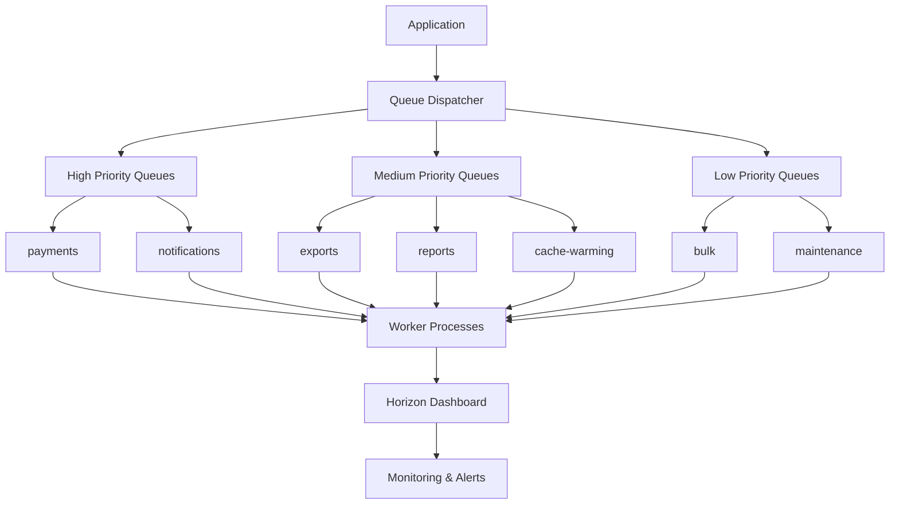

# Queue & Worker System - Comprehensive Guide

## Overview

The ACME Corp CSR Platform implements a sophisticated queue system using Redis and Laravel Horizon for enterprise-grade background job processing. The system handles over 30 different job types across 8 specialized queues with priority-based processing and advanced failure handling.

## Architecture Overview



## Queue Configuration

### High Priority Queues (1-2)

#### payments
**Purpose**: Critical payment processing operations
**Configuration**:
- **Timeout**: 180 seconds
- **Memory**: 256MB
- **Max Tries**: 5
- **Backoff**: [30, 60, 120, 300, 600] seconds
- **Block For**: 5 seconds

**Jobs**:
- `ProcessPaymentWebhookJob` - Stripe webhook processing
- `ProcessDonationJob` - Core donation processing
- `RefundProcessingJob` - Payment refunds

#### notifications
**Purpose**: User notifications and communication
**Configuration**:
- **Timeout**: 120 seconds
- **Memory**: 128MB
- **Max Tries**: 3
- **Backoff**: [15, 30, 60] seconds
- **Block For**: 5 seconds

**Jobs**:
- `SendEmailJob` - Priority-based email sending
- `SendPaymentConfirmationJob` - Payment confirmations
- `SendRefundNotificationJob` - Refund notifications
- `SendAdminNotificationJob` - Admin alerts
- `SendMilestoneNotificationJob` - Campaign milestone alerts
- `JobFailureNotificationJob` - System failure alerts

### Medium Priority Queues (3-5)

#### exports
**Purpose**: Large data export operations
**Configuration**:
- **Timeout**: 900 seconds (15 minutes)
- **Memory**: 1024MB (1GB)
- **Max Tries**: 2
- **Backoff**: [60, 180] seconds
- **Block For**: 10 seconds

**Jobs**:
- `ProcessDonationExportJob` - Donation data exports
- `ExportDonationsJob` - Campaign donation exports

#### reports
**Purpose**: Report generation and analytics
**Configuration**:
- **Timeout**: 600 seconds (10 minutes)
- **Memory**: 512MB
- **Max Tries**: 3
- **Backoff**: [30, 120, 300] seconds
- **Block For**: 10 seconds

**Jobs**:
- `GenerateTaxReceiptJob` - Tax receipt generation
- Various reporting jobs

#### cache-warming
**Purpose**: Cache warming operations
**Configuration**:
- **Timeout**: 900 seconds (15 minutes)
- **Memory**: 256MB
- **Max Tries**: 3
- **Backoff**: [60, 180, 300] seconds
- **Block For**: 5 seconds

**Jobs**:
- `WarmCacheJob` - General cache warming
- `WarmUserDashboardCacheJob` - User dashboard caching

#### cache-warming-orchestrator
**Purpose**: Cache warming coordination
**Configuration**:
- **Timeout**: 60 seconds
- **Memory**: 128MB
- **Max Tries**: 1 (no retries)
- **Block For**: 2 seconds

### Low Priority Queues (6-8)

#### bulk
**Purpose**: Bulk operations and mass processing
**Configuration**:
- **Timeout**: 3600 seconds (1 hour)
- **Memory**: 1024MB (1GB)
- **Max Tries**: 1
- **Block For**: 20 seconds

**Jobs**:
- `BulkNotificationProcessingJob` - Mass notifications
- `SendChunkedCampaignUpdateNotificationJob` - Bulk campaign updates
- `ProcessImportJob` - Data imports

#### maintenance
**Purpose**: System maintenance and cleanup
**Configuration**:
- **Timeout**: 1800 seconds (30 minutes)
- **Memory**: 256MB
- **Max Tries**: 1
- **Block For**: 15 seconds

**Jobs**:
- `QueuedCacheInvalidationJob` - Cache invalidation
- `JobMonitoringJob` - Job health monitoring
- `CleanupExpiredDataJob` - Data cleanup
- `ProvisionOrganizationTenantJob` - Tenant provisioning

#### scout (Special Queue)
**Purpose**: Search indexing operations
**Configuration**: Uses default Laravel Scout settings

**Jobs**:
- `IndexCampaignChunkJob` - Meilisearch campaign indexing
- `IndexCampaignBatchJob` - Batch indexing operations
- `ScoutBatchIndexJob` - General search indexing
- `IndexEntityJob` - Entity indexing

## Job Priority System

### Priority Levels (1-10 scale)

```php
// Email job priority assignment
$queueName = match (true) {
    $priority >= 8 => 'notifications', // Critical notifications
    $priority >= 5 => 'notifications', // Standard notifications
    default => 'bulk',                 // Low priority bulk emails
};
```

### Queue Processing Order
1. **payments** - Immediate processing, multiple workers
2. **notifications** - Fast processing for user experience
3. **exports** - Dedicated high-memory workers
4. **reports** - Background processing
5. **cache-warming** - Performance optimization
6. **bulk** - Off-peak processing
7. **maintenance** - Scheduled background tasks

## Worker Management

### Horizon Configuration

```php
// config/horizon.php
'waits' => [
    'redis:payments' => 60,        // Alert if queue waits > 1 min
    'redis:notifications' => 120,  // Alert if queue waits > 2 min
    'redis:reports' => 300,        // Alert if queue waits > 5 min
    'redis:exports' => 600,        // Alert if queue waits > 10 min
    'redis:default' => 300,        // Alert if queue waits > 5 min
    'redis:bulk' => 900,          // Alert if queue waits > 15 min
    'redis:maintenance' => 1800,   // Alert if queue waits > 30 min
],
```

### Worker Scaling Strategy

#### Production Environment
```bash
# High priority workers (multiple instances)
php artisan horizon:work --queue=payments --max-processes=5
php artisan horizon:work --queue=notifications --max-processes=3

# Medium priority workers
php artisan horizon:work --queue=exports --max-processes=2
php artisan horizon:work --queue=reports --max-processes=2
php artisan horizon:work --queue=cache-warming --max-processes=2

# Low priority workers (single instances)
php artisan horizon:work --queue=bulk --max-processes=1
php artisan horizon:work --queue=maintenance --max-processes=1
```

#### Development Environment
```bash
# Single worker for all queues
php artisan queue:work --queue=payments,notifications,exports,reports,cache-warming,bulk,maintenance
```

## Job Reliability Features

### Failure Handling

```php
// Example job configuration
class ProcessPaymentWebhookJob implements ShouldQueue
{
    public int $tries = 5;                           // Maximum attempts
    public int $timeout = 180;                       // Timeout in seconds
    public int $maxExceptions = 3;                   // Max exceptions before failure
    public array $backoff = [30, 60, 120, 300, 600]; // Progressive backoff
    public bool $deleteWhenMissingModels = true;     // Auto-cleanup
}
```

### Monitoring & Alerting

#### Job Failure Notifications
- Automatic notifications for critical job failures
- Detailed error logs with stack traces
- Slack/email integration for immediate alerts

#### Health Monitoring
```bash
# Queue monitoring command
php artisan queue:monitor

# Job progress tracking
php artisan queue:status

# Failed job retry
php artisan queue:retry all
```

### Performance Monitoring

#### Key Metrics Tracked
- **Throughput**: Jobs processed per minute
- **Wait Time**: Time jobs spend in queue
- **Processing Time**: Average job execution time
- **Success Rate**: Percentage of successful job completions
- **Memory Usage**: Memory consumption per queue

## Common Queue Operations

### Starting Workers
```bash
# Start Horizon (production)
php artisan horizon

# Start single worker (development)
php artisan queue:work

# Start specific queue worker
php artisan queue:work --queue=payments
```

### Job Management
```bash
# List failed jobs
php artisan queue:failed

# Retry specific failed job
php artisan queue:retry 5

# Retry all failed jobs
php artisan queue:retry all

# Clear failed jobs
php artisan queue:flush
```

### Queue Statistics
```bash
# View queue status
php artisan queue:monitor

# Horizon dashboard stats
# Visit: /admin/horizon

# Job batches status
php artisan queue:batches
```

## Troubleshooting Guide

### Common Issues

#### High Queue Wait Times
1. **Symptoms**: Jobs waiting longer than threshold
2. **Causes**: Insufficient workers, resource constraints
3. **Solutions**:
   - Scale worker processes
   - Optimize job performance
   - Check Redis memory usage

#### Memory Issues
1. **Symptoms**: Workers killed by OOM
2. **Causes**: Large job payloads, memory leaks
3. **Solutions**:
   - Increase memory limits
   - Implement job chunking
   - Review job data serialization

#### Job Failures
1. **Symptoms**: Jobs consistently failing
2. **Causes**: External service issues, data corruption
3. **Solutions**:
   - Check external service status
   - Validate job data
   - Review error logs

### Debugging Commands

```bash
# View job details
php artisan queue:monitor --verbose

# Debug failed job
php artisan tinker
>>> \Illuminate\Support\Facades\Queue::failing()->first();

# Check Redis queue status
redis-cli llen "queues:payments"
```

## Module-Specific Job Organization

### Campaign Module
- **Location**: `modules/Campaign/Infrastructure/Laravel/Jobs/`
- **Primary Queue**: `scout` (search indexing)
- **Jobs**: Search indexing, batch operations

### Donation Module
- **Location**: `modules/Donation/Infrastructure/Laravel/Jobs/`
- **Primary Queues**: `payments`, `notifications`
- **Jobs**: Payment processing, confirmations, refunds

### Shared Module
- **Location**: `modules/Shared/Infrastructure/Laravel/Jobs/`
- **Primary Queues**: Various based on job type
- **Jobs**: Email sending, cache management, cleanup

### Export Module
- **Location**: `modules/Export/Infrastructure/Laravel/Jobs/`
- **Primary Queue**: `exports`
- **Jobs**: Data export processing

## Best Practices

### Job Design
1. **Keep jobs focused** - Single responsibility principle
2. **Handle failures gracefully** - Implement proper error handling
3. **Use appropriate timeouts** - Match timeout to job complexity
4. **Serialize minimal data** - Reduce job payload size

### Queue Selection
1. **Critical operations** `payments` queue
2. **User notifications** `notifications` queue
3. **Large exports** `exports` queue
4. **Background reports** `reports` queue
5. **Cache operations** `cache-warming` queue
6. **Bulk processing** `bulk` queue
7. **System maintenance** `maintenance` queue

### Monitoring
1. **Set up alerts** for queue wait times
2. **Monitor job success rates** regularly
3. **Track memory usage** per queue
4. **Review failed jobs** daily

---

**Developed and Maintained by Go2digit.al**

Specialized in enterprise-grade applications with focus on scalability, security, and maintainability.

Copyright 2025 Go2digit.al - All Rights Reserved