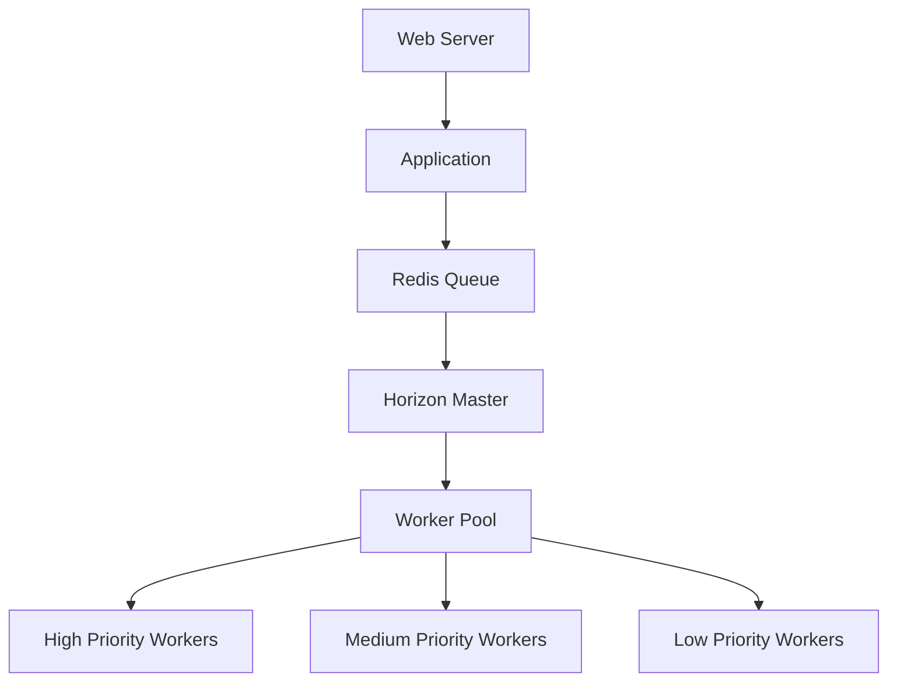
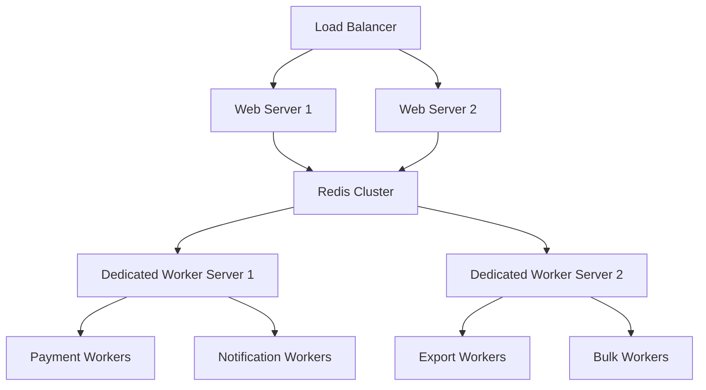

# Worker Deployment & Scaling Guide

## Overview

This guide covers deployment strategies, scaling patterns, and operational procedures for managing queue workers in production environments. The ACME Corp CSR Platform supports multiple deployment scenarios from single-server setups to distributed worker clusters.

## Deployment Architectures

### Single Server Deployment



**Suitable for**: Development, staging, small production deployments

**Configuration**:
```bash
# Single Horizon instance managing all queues
php artisan horizon
```

### Multi-Server Deployment



**Suitable for**: High-traffic production environments

## Worker Scaling Strategies

### Priority-Based Scaling

#### High Priority Queues
```bash
# payments queue - Multiple workers, fast processing
supervisor_payments_worker_1:
  command: php artisan queue:work redis --queue=payments --sleep=1 --tries=5 --max-jobs=1000 --max-time=3600
  numprocs: 3
  process_name: payments_worker_%(process_num)02d

# notifications queue - Fast user-facing operations
supervisor_notifications_worker_1:
  command: php artisan queue:work redis --queue=notifications --sleep=1 --tries=3 --max-jobs=2000 --max-time=3600
  numprocs: 2
  process_name: notifications_worker_%(process_num)02d
```

#### Medium Priority Queues
```bash
# exports queue - High memory, longer timeout
supervisor_exports_worker_1:
  command: php artisan queue:work redis --queue=exports --sleep=3 --tries=2 --max-jobs=10 --max-time=7200 --memory=1024
  numprocs: 2
  process_name: exports_worker_%(process_num)02d

# reports queue - Balanced processing
supervisor_reports_worker_1:
  command: php artisan queue:work redis --queue=reports --sleep=2 --tries=3 --max-jobs=100 --max-time=3600 --memory=512
  numprocs: 1
  process_name: reports_worker_%(process_num)02d
```

#### Low Priority Queues
```bash
# bulk queue - Large batches, off-peak processing
supervisor_bulk_worker_1:
  command: php artisan queue:work redis --queue=bulk --sleep=5 --tries=1 --max-jobs=5 --max-time=14400 --memory=1024
  numprocs: 1
  process_name: bulk_worker_%(process_num)02d

# maintenance queue - System maintenance
supervisor_maintenance_worker_1:
  command: php artisan queue:work redis --queue=maintenance --sleep=10 --tries=1 --max-jobs=50 --max-time=7200
  numprocs: 1
  process_name: maintenance_worker_%(process_num)02d
```

## Supervisor Configuration

### Main Supervisor Config
```ini
# /etc/supervisor/conf.d/acme-workers.conf
[group:acme-workers]
programs=payments-worker,notifications-worker,exports-worker,reports-worker,bulk-worker,maintenance-worker,cache-warming-worker

[program:payments-worker]
process_name=%(program_name)s_%(process_num)02d
command=php /var/www/acme-corp/artisan queue:work redis --queue=payments --sleep=1 --tries=5 --max-jobs=1000 --max-time=3600
directory=/var/www/acme-corp
autostart=true
autorestart=true
startretries=3
user=www-data
numprocs=3
redirect_stderr=true
stdout_logfile=/var/log/supervisor/payments-worker.log
stdout_logfile_maxbytes=100MB
stdout_logfile_backups=5
stderr_logfile=/var/log/supervisor/payments-worker-error.log

[program:notifications-worker]
process_name=%(program_name)s_%(process_num)02d
command=php /var/www/acme-corp/artisan queue:work redis --queue=notifications --sleep=1 --tries=3 --max-jobs=2000 --max-time=3600
directory=/var/www/acme-corp
autostart=true
autorestart=true
startretries=3
user=www-data
numprocs=2
redirect_stderr=true
stdout_logfile=/var/log/supervisor/notifications-worker.log

[program:exports-worker]
process_name=%(program_name)s_%(process_num)02d
command=php /var/www/acme-corp/artisan queue:work redis --queue=exports --sleep=3 --tries=2 --max-jobs=10 --max-time=7200 --memory=1024
directory=/var/www/acme-corp
autostart=true
autorestart=true
startretries=3
user=www-data
numprocs=2
redirect_stderr=true
stdout_logfile=/var/log/supervisor/exports-worker.log

[program:reports-worker]
process_name=%(program_name)s_%(process_num)02d
command=php /var/www/acme-corp/artisan queue:work redis --queue=reports --sleep=2 --tries=3 --max-jobs=100 --max-time=3600 --memory=512
directory=/var/www/acme-corp
autostart=true
autorestart=true
startretries=3
user=www-data
numprocs=1
redirect_stderr=true
stdout_logfile=/var/log/supervisor/reports-worker.log

[program:cache-warming-worker]
process_name=%(program_name)s_%(process_num)02d
command=php /var/www/acme-corp/artisan queue:work redis --queue=cache-warming,cache-warming-orchestrator --sleep=2 --tries=3 --max-jobs=200 --max-time=3600
directory=/var/www/acme-corp
autostart=true
autorestart=true
startretries=3
user=www-data
numprocs=2
redirect_stderr=true
stdout_logfile=/var/log/supervisor/cache-warming-worker.log

[program:bulk-worker]
process_name=%(program_name)s_%(process_num)02d
command=php /var/www/acme-corp/artisan queue:work redis --queue=bulk --sleep=5 --tries=1 --max-jobs=5 --max-time=14400 --memory=1024
directory=/var/www/acme-corp
autostart=true
autorestart=true
startretries=3
user=www-data
numprocs=1
redirect_stderr=true
stdout_logfile=/var/log/supervisor/bulk-worker.log

[program:maintenance-worker]
process_name=%(program_name)s_%(process_num)02d
command=php /var/www/acme-corp/artisan queue:work redis --queue=maintenance --sleep=10 --tries=1 --max-jobs=50 --max-time=7200
directory=/var/www/acme-corp
autostart=true
autorestart=true
startretries=3
user=www-data
numprocs=1
redirect_stderr=true
stdout_logfile=/var/log/supervisor/maintenance-worker.log
```

## Horizon-Based Deployment

### Horizon Configuration
```php
// config/horizon.php - Production Environment
'production' => [
    'supervisor-1' => [
        'connection' => 'redis',
        'queue' => ['payments'],
        'balance' => 'auto',
        'max_processes' => 5,
        'max_jobs' => 1000,
        'max_time' => 3600,
        'timeout' => 180,
        'memory' => 256,
        'tries' => 5,
        'nice' => 0,
    ],
    'supervisor-2' => [
        'connection' => 'redis',
        'queue' => ['notifications'],
        'balance' => 'auto',
        'max_processes' => 3,
        'max_jobs' => 2000,
        'max_time' => 3600,
        'timeout' => 120,
        'memory' => 128,
        'tries' => 3,
        'nice' => 0,
    ],
    'supervisor-3' => [
        'connection' => 'redis',
        'queue' => ['exports', 'reports'],
        'balance' => 'auto',
        'max_processes' => 2,
        'max_jobs' => 100,
        'max_time' => 7200,
        'timeout' => 900,
        'memory' => 1024,
        'tries' => 2,
        'nice' => 0,
    ],
    'supervisor-4' => [
        'connection' => 'redis',
        'queue' => ['cache-warming', 'cache-warming-orchestrator'],
        'balance' => 'auto',
        'max_processes' => 2,
        'max_jobs' => 500,
        'max_time' => 3600,
        'timeout' => 900,
        'memory' => 256,
        'tries' => 3,
        'nice' => 0,
    ],
    'supervisor-5' => [
        'connection' => 'redis',
        'queue' => ['bulk', 'maintenance'],
        'balance' => 'simple',
        'max_processes' => 1,
        'max_jobs' => 50,
        'max_time' => 14400,
        'timeout' => 3600,
        'memory' => 1024,
        'tries' => 1,
        'nice' => 5, // Lower priority
    ],
],
```

### Horizon Supervisor Config
```ini
# /etc/supervisor/conf.d/horizon.conf
[program:horizon]
process_name=%(program_name)s
command=php /var/www/acme-corp/artisan horizon
directory=/var/www/acme-corp
autostart=true
autorestart=true
user=www-data
redirect_stderr=true
stdout_logfile=/var/log/supervisor/horizon.log
stdout_logfile_maxbytes=100MB
stdout_logfile_backups=10
stopwaitsecs=3600
```

## Docker Deployment

### Docker Compose Configuration
```yaml
# docker-compose.yml - Worker Services
version: '3.8'

services:
  # High Priority Workers
  payments-worker:
    image: acme-corp:latest
    command: php artisan queue:work redis --queue=payments --sleep=1 --tries=5 --max-jobs=1000 --max-time=3600
    environment:
      - QUEUE_CONNECTION=redis
      - REDIS_HOST=redis
    volumes:
      - ./storage/logs:/var/www/storage/logs
    depends_on:
      - redis
    restart: unless-stopped
    deploy:
      replicas: 3

  notifications-worker:
    image: acme-corp:latest
    command: php artisan queue:work redis --queue=notifications --sleep=1 --tries=3 --max-jobs=2000 --max-time=3600
    environment:
      - QUEUE_CONNECTION=redis
      - REDIS_HOST=redis
    volumes:
      - ./storage/logs:/var/www/storage/logs
    depends_on:
      - redis
    restart: unless-stopped
    deploy:
      replicas: 2

  # Medium Priority Workers
  exports-worker:
    image: acme-corp:latest
    command: php artisan queue:work redis --queue=exports --sleep=3 --tries=2 --max-jobs=10 --max-time=7200 --memory=1024
    environment:
      - QUEUE_CONNECTION=redis
      - REDIS_HOST=redis
    volumes:
      - ./storage/logs:/var/www/storage/logs
    depends_on:
      - redis
    restart: unless-stopped
    deploy:
      replicas: 2
      resources:
        limits:
          memory: 1200M

  # Low Priority Workers
  bulk-worker:
    image: acme-corp:latest
    command: php artisan queue:work redis --queue=bulk,maintenance --sleep=5 --tries=1 --max-jobs=20 --max-time=14400 --memory=1024
    environment:
      - QUEUE_CONNECTION=redis
      - REDIS_HOST=redis
    volumes:
      - ./storage/logs:/var/www/storage/logs
    depends_on:
      - redis
    restart: unless-stopped
    deploy:
      replicas: 1
      resources:
        limits:
          memory: 1200M

  # Cache Warming Workers
  cache-worker:
    image: acme-corp:latest
    command: php artisan queue:work redis --queue=cache-warming,cache-warming-orchestrator --sleep=2 --tries=3 --max-jobs=200 --max-time=3600
    environment:
      - QUEUE_CONNECTION=redis
      - REDIS_HOST=redis
    volumes:
      - ./storage/logs:/var/www/storage/logs
    depends_on:
      - redis
    restart: unless-stopped
    deploy:
      replicas: 2

  # Horizon Dashboard (Production)
  horizon:
    image: acme-corp:latest
    command: php artisan horizon
    environment:
      - QUEUE_CONNECTION=redis
      - REDIS_HOST=redis
    volumes:
      - ./storage/logs:/var/www/storage/logs
    depends_on:
      - redis
    restart: unless-stopped
    ports:
      - "8080:8080" # For Horizon dashboard
```

## Auto-Scaling Configuration

### Kubernetes Horizontal Pod Autoscaler
```yaml
# k8s/worker-hpa.yaml
apiVersion: autoscaling/v2
kind: HorizontalPodAutoscaler
metadata:
  name: payments-worker-hpa
spec:
  scaleTargetRef:
    apiVersion: apps/v1
    kind: Deployment
    name: payments-worker
  minReplicas: 2
  maxReplicas: 10
  metrics:
  - type: Resource
    resource:
      name: cpu
      target:
        type: Utilization
        averageUtilization: 70
  - type: Resource
    resource:
      name: memory
      target:
        type: Utilization
        averageUtilization: 80
  - type: External
    external:
      metric:
        name: redis_queue_length
        selector:
          matchLabels:
            queue: payments
      target:
        type: AverageValue
        averageValue: "100"
```

### AWS Auto Scaling Group
```bash
# Auto Scaling based on queue length
aws autoscaling put-scaling-policy \
    --auto-scaling-group-name acme-workers \
    --policy-name scale-up-on-queue-length \
    --policy-type TargetTrackingScaling \
    --target-tracking-configuration '{
        "TargetValue": 50.0,
        "CustomizedMetricSpecification": {
            "MetricName": "QueueLength",
            "Namespace": "ACME/Queue",
            "Dimensions": [{"Name": "QueueName", "Value": "payments"}],
            "Statistic": "Average"
        }
    }'
```

## Performance Optimization

### Memory Management
```bash
# Memory-optimized worker configuration
php artisan queue:work \
    --queue=exports \
    --memory=1024 \       # 1GB memory limit
    --max-jobs=5 \        # Restart after 5 jobs
    --max-time=7200       # Restart after 2 hours
```

### CPU Optimization
```bash
# CPU-optimized for high throughput
php artisan queue:work \
    --queue=notifications \
    --sleep=0 \           # No sleep between jobs
    --max-jobs=5000 \     # Process many jobs
    --max-time=1800       # Restart every 30 minutes
```

### I/O Optimization
```bash
# I/O optimized for exports
php artisan queue:work \
    --queue=exports \
    --sleep=3 \           # Allow I/O recovery
    --max-jobs=1 \        # One job at a time
    --timeout=1800        # 30 minute timeout
```

## Monitoring Integration

### Custom Metrics Collection
```bash
# Custom monitoring script
#!/bin/bash
# /usr/local/bin/queue-metrics.sh

# Collect queue lengths
for queue in payments notifications exports reports bulk maintenance; do
    length=$(redis-cli llen "queues:$queue")
    echo "queue_length{queue=\"$queue\"} $length"
done

# Collect worker process count
workers=$(pgrep -c "queue:work")
echo "active_workers $workers"

# Memory usage
memory=$(ps -eo pid,ppid,cmd,%mem,%cpu --sort=-%mem | grep "queue:work" | awk '{sum+=$4} END {print sum}')
echo "worker_memory_usage $memory"
```

### Prometheus Integration
```yaml
# prometheus.yml - Queue metrics scraping
- job_name: 'acme-queue-metrics'
  static_configs:
    - targets: ['worker-node-1:9090', 'worker-node-2:9090']
  metrics_path: /queue-metrics
  scrape_interval: 30s
```

## Deployment Commands

### Initial Deployment
```bash
# 1. Update application code
git pull origin production

# 2. Install dependencies
composer install --no-dev --optimize-autoloader

# 3. Run migrations
php artisan migrate --force

# 4. Clear caches
php artisan config:cache
php artisan route:cache
php artisan view:cache

# 5. Restart workers gracefully
php artisan queue:restart

# 6. Start new workers
supervisorctl restart acme-workers:*
```

### Zero-Downtime Deployment
```bash
#!/bin/bash
# deploy-workers.sh

# 1. Deploy new code to staging directory
rsync -av --exclude=storage /var/www/acme-corp-new/ /var/www/acme-corp-staging/

# 2. Test new deployment
cd /var/www/acme-corp-staging
php artisan queue:work --once --queue=payments

# 3. Graceful worker shutdown
php artisan queue:restart

# 4. Wait for current jobs to complete
sleep 30

# 5. Switch to new deployment
ln -sfn /var/www/acme-corp-staging /var/www/acme-corp-current

# 6. Restart workers with new code
supervisorctl restart acme-workers:*
```

## Disaster Recovery

### Backup Procedures
```bash
# Queue state backup
redis-cli --rdb /backup/redis-queue-$(date +%Y%m%d).rdb

# Job state export
php artisan queue:failed > /backup/failed-jobs-$(date +%Y%m%d).json
```

### Recovery Procedures
```bash
# 1. Restore Redis data
redis-cli flushall
redis-cli --pipe < /backup/redis-queue-20250117.rdb

# 2. Restart workers
supervisorctl restart acme-workers:*

# 3. Monitor recovery
php artisan queue:monitor
```

---

**Developed and Maintained by Go2digit.al**

Specialized in enterprise-grade applications with focus on scalability, security, and maintainability.

Copyright 2025 Go2digit.al - All Rights Reserved