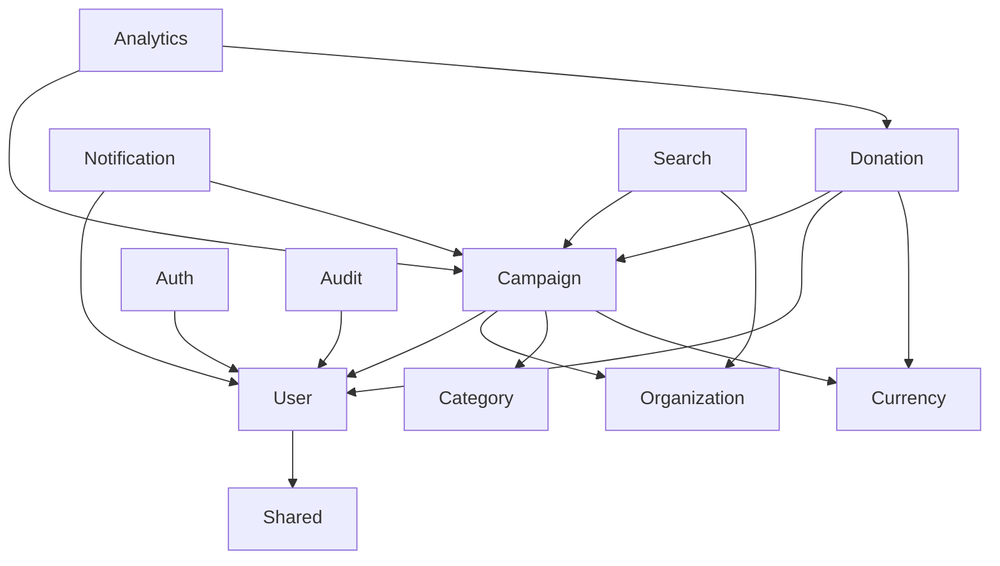

# Module Overview

## Introduction

The ACME Corp CSR Platform is built using a modular architecture where each module represents a bounded context in the domain-driven design approach. Each module follows strict hexagonal architecture principles and maintains clear boundaries through well-defined interfaces.

## Module Architecture Pattern

Every module in the platform follows this consistent structure:

```
modules/[ModuleName]/
├── Domain/                    # Core business logic (innermost layer)
│   ├── Model/                # Rich domain models with business rules
│   ├── ValueObject/          # Immutable value objects for type safety
│   ├── Repository/           # Repository interfaces (contracts only)
│   ├── Specification/        # Business rule specifications
│   ├── Exception/            # Domain-specific exceptions
│   └── Event/                # Domain events for module communication
├── Application/              # Use case orchestration (middle layer)
│   ├── Command/              # CQRS Commands and Handlers (write operations)
│   ├── Query/                # CQRS Queries and Handlers (read operations)
│   ├── ReadModel/            # Optimized read models for queries
│   └── Service/              # Application services (if needed)
└── Infrastructure/           # External adapters (outermost layer)
    ├── Laravel/              # Laravel-specific implementations
    │   ├── Models/           # Eloquent models (persistence only)
    │   ├── Repository/       # Repository implementations
    │   ├── Migration/        # Database migrations
    │   ├── Factory/          # Model factories for testing
    │   ├── Seeder/           # Database seeders
    │   └── Provider/         # Service providers
    ├── ApiPlatform/          # API Platform adapters (Pure API-first)
    │   ├── State/            # Processors and Providers for operations
    │   └── Resource/         # API resource definitions
    └── Filament/             # Admin interface adapters
        ├── Pages/            # Custom admin pages
        └── Resources/        # Admin resource definitions
```

## Core Modules

### Admin Module
**Purpose**: Administrative interface and management functionality

**Domain Responsibilities**:
- Admin user management
- System configuration
- Administrative workflows
- Permission management

**Key Components**:
- `AdminUser` - Domain model for administrative users
- `AdminPermission` - Permission management
- `SystemConfiguration` - Application settings

**API Endpoints**:
- `/api/admin/users` - Admin user management
- `/api/admin/config` - System configuration
- `/api/admin/audit` - Audit log access

### Analytics Module
**Purpose**: Data analytics and reporting functionality

**Domain Responsibilities**:
- Campaign performance metrics
- Donation analytics
- User engagement tracking
- Report generation

**Key Components**:
- `CampaignMetrics` - Campaign performance data
- `DonationAnalytics` - Donation pattern analysis
- `UserEngagement` - User activity tracking
- `Report` - Generated reports

**API Endpoints**:
- `/api/analytics/campaigns` - Campaign metrics
- `/api/analytics/donations` - Donation analytics
- `/api/analytics/reports` - Generated reports

### Audit Module
**Purpose**: System audit trail and compliance tracking

**Domain Responsibilities**:
- Action logging
- Change tracking
- Compliance reporting
- Security monitoring

**Key Components**:
- `AuditLog` - System action logs
- `ChangeRecord` - Entity change tracking
- `ComplianceReport` - Regulatory compliance

**API Endpoints**:
- `/api/audit/logs` - Audit log entries
- `/api/audit/changes` - Change history
- `/api/audit/compliance` - Compliance reports

### Auth Module
**Purpose**: Authentication and authorization

**Domain Responsibilities**:
- User authentication
- Token management
- Permission verification
- Session handling

**Key Components**:
- `AuthToken` - JWT token management
- `LoginAttempt` - Login attempt tracking
- `Permission` - Authorization permissions
- `Session` - User session management

**API Endpoints**:
- `/api/auth/login` - User authentication
- `/api/auth/logout` - Session termination
- `/api/auth/refresh` - Token refresh
- `/api/auth/verify` - Email verification

### Bookmark Module
**Purpose**: User bookmark and favorites functionality

**Domain Responsibilities**:
- Campaign bookmarking
- Favorite management
- Personal collections
- Quick access lists

**Key Components**:
- `Bookmark` - User bookmarks
- `BookmarkCollection` - Organized bookmark groups
- `UserFavorites` - Favorite items

**API Endpoints**:
- `/api/bookmarks` - Bookmark management
- `/api/bookmarks/collections` - Bookmark collections

### CacheWarming Module
**Purpose**: Application cache optimization and warming

**Domain Responsibilities**:
- Cache preloading
- Performance optimization
- Content preparation
- Background cache updates

**Key Components**:
- `CacheWarmer` - Cache warming logic
- `CacheStrategy` - Caching strategies
- `WarmupSchedule` - Scheduled warming

**Commands**:
- `cache:warm` - Warm application caches
- `cache:schedule` - Schedule cache warming

### Campaign Module
**Purpose**: Core campaign management functionality

**Domain Responsibilities**:
- Campaign creation and management
- Goal tracking
- Status management
- Campaign lifecycle

**Key Components**:
- `Campaign` - Primary domain model
- `CampaignGoal` - Financial targets
- `CampaignStatus` - Lifecycle states
- `CampaignCategory` - Classification

**API Endpoints**:
- `/api/campaigns` - Campaign CRUD operations
- `/api/campaigns/{id}/donations` - Campaign donations
- `/api/campaigns/{id}/analytics` - Campaign metrics

### Category Module
**Purpose**: Campaign and content categorization

**Domain Responsibilities**:
- Category management
- Classification systems
- Hierarchical organization
- Tag management

**Key Components**:
- `Category` - Category definitions
- `CategoryHierarchy` - Category relationships
- `Tag` - Content tags

**API Endpoints**:
- `/api/categories` - Category management
- `/api/categories/{id}/campaigns` - Category campaigns

### Compliance Module
**Purpose**: Regulatory compliance and legal requirements

**Domain Responsibilities**:
- GDPR compliance
- Data protection
- Legal documentation
- Compliance reporting

**Key Components**:
- `ComplianceRule` - Compliance requirements
- `DataProtection` - GDPR implementation
- `LegalDocument` - Legal documentation

**API Endpoints**:
- `/api/compliance/reports` - Compliance reports
- `/api/compliance/gdpr` - GDPR requests

### Currency Module
**Purpose**: Multi-currency support and conversion

**Domain Responsibilities**:
- Currency definitions
- Exchange rate management
- Currency conversion
- Regional settings

**Key Components**:
- `Currency` - Currency definitions
- `ExchangeRate` - Conversion rates
- `Money` - Value object for monetary amounts
- `CurrencyConverter` - Conversion service

**API Endpoints**:
- `/api/currencies` - Supported currencies
- `/api/currencies/convert` - Currency conversion
- `/api/currencies/rates` - Exchange rates

### Dashboard Module
**Purpose**: User dashboard and overview functionality

**Domain Responsibilities**:
- User dashboard layout
- Widget management
- Personal metrics
- Quick actions

**Key Components**:
- `Dashboard` - Dashboard configuration
- `Widget` - Dashboard widgets
- `UserMetrics` - Personal statistics

**API Endpoints**:
- `/api/dashboard` - Dashboard data
- `/api/dashboard/widgets` - Widget configuration

### DevTools Module
**Purpose**: Development and debugging utilities

**Domain Responsibilities**:
- Development utilities
- Debug information
- Performance monitoring
- Developer tools

**Key Components**:
- `DebugInfo` - Debug information
- `PerformanceMetrics` - Performance data
- `DevUtility` - Development utilities

**Commands**:
- `dev:analyze` - Analyze application
- `dev:performance` - Performance analysis

### Donation Module
**Purpose**: Donation processing and management

**Domain Responsibilities**:
- Donation processing
- Payment integration
- Receipt generation
- Donation tracking

**Key Components**:
- `Donation` - Donation domain model
- `PaymentMethod` - Payment processing
- `Receipt` - Donation receipts
- `DonationTransaction` - Transaction tracking

**API Endpoints**:
- `/api/donations` - Donation management
- `/api/donations/{id}/receipt` - Receipt generation
- `/api/donations/webhooks` - Payment webhooks

### Export Module
**Purpose**: Data export and reporting functionality

**Domain Responsibilities**:
- Data export
- Report generation
- File formatting
- Bulk operations

**Key Components**:
- `ExportJob` - Export operations
- `ReportGenerator` - Report creation
- `DataFormatter` - Data formatting

**API Endpoints**:
- `/api/exports` - Export management
- `/api/exports/{id}/download` - Export download

### Import Module
**Purpose**: Data import and bulk operations

**Domain Responsibilities**:
- Data import
- Bulk processing
- Data validation
- Import tracking

**Key Components**:
- `ImportJob` - Import operations
- `DataValidator` - Data validation
- `BulkProcessor` - Bulk operations

**API Endpoints**:
- `/api/imports` - Import management
- `/api/imports/{id}/status` - Import status

### Localization Module
**Purpose**: Multi-language support and internationalization

**Domain Responsibilities**:
- Language management
- Translation services
- Locale settings
- Content localization

**Key Components**:
- `Language` - Language definitions
- `Translation` - Content translations
- `Locale` - Regional settings

**API Endpoints**:
- `/api/localization/languages` - Supported languages
- `/api/localization/translations` - Translation data

### Notification Module
**Purpose**: Notification system and messaging

**Domain Responsibilities**:
- Notification delivery
- Message templates
- Communication preferences
- Notification tracking

**Key Components**:
- `Notification` - Notification model
- `NotificationTemplate` - Message templates
- `NotificationPreference` - User preferences
- `NotificationChannel` - Delivery channels

**API Endpoints**:
- `/api/notifications` - Notification management
- `/api/notifications/preferences` - User preferences

### Organization Module
**Purpose**: Organization and company management

**Domain Responsibilities**:
- Organization profiles
- Company information
- Organization settings
- Hierarchical structure

**Key Components**:
- `Organization` - Organization model
- `OrganizationProfile` - Company details
- `OrganizationSettings` - Configuration
- `OrganizationHierarchy` - Structure

**API Endpoints**:
- `/api/organizations` - Organization management
- `/api/organizations/{id}/campaigns` - Organization campaigns
- `/api/organizations/{id}/users` - Organization users

### Search Module
**Purpose**: Search functionality and indexing

**Domain Responsibilities**:
- Content indexing
- Search queries
- Result ranking
- Search analytics

**Key Components**:
- `SearchIndex` - Search indexing
- `SearchQuery` - Search operations
- `SearchResult` - Search results
- `SearchAnalytics` - Search metrics

**API Endpoints**:
- `/api/search` - Global search
- `/api/search/campaigns` - Campaign search
- `/api/search/suggestions` - Search suggestions

### Shared Module
**Purpose**: Common functionality shared across modules

**Domain Responsibilities**:
- Common value objects
- Shared utilities
- Cross-cutting concerns
- Base abstractions

**Key Components**:
- `Money` - Monetary value object
- `Email` - Email value object
- `Address` - Address value object
- `DateRange` - Date range value object

### Team Module
**Purpose**: Team management and collaboration

**Domain Responsibilities**:
- Team creation
- Member management
- Team permissions
- Collaboration tools

**Key Components**:
- `Team` - Team model
- `TeamMember` - Team membership
- `TeamPermission` - Team permissions

**API Endpoints**:
- `/api/teams` - Team management
- `/api/teams/{id}/members` - Team members

### Tenancy Module
**Purpose**: Multi-tenant architecture support

**Domain Responsibilities**:
- Tenant management
- Data isolation
- Tenant configuration
- Multi-tenancy support

**Key Components**:
- `Tenant` - Tenant model
- `TenantConfiguration` - Tenant settings
- `TenantContext` - Tenant context

### Theme Module
**Purpose**: UI theming and customization

**Domain Responsibilities**:
- Theme management
- UI customization
- Brand settings
- Visual configuration

**Key Components**:
- `Theme` - Theme configuration
- `ThemeSettings` - Theme options
- `BrandConfiguration` - Brand settings

### User Module
**Purpose**: User management and profiles

**Domain Responsibilities**:
- User profiles
- Account management
- User preferences
- Profile information

**Key Components**:
- `User` - User domain model
- `UserProfile` - Profile information
- `UserPreferences` - User settings
- `UserRole` - Role management

**API Endpoints**:
- `/api/users` - User management
- `/api/users/profile` - User profile
- `/api/users/preferences` - User preferences

## Module Dependencies

### Dependency Rules

1. **Domain Layer**: No dependencies on other modules
2. **Application Layer**: May depend on domain layer of other modules via interfaces
3. **Infrastructure Layer**: May depend on application and domain layers

### Core Dependencies



### Cross-Module Communication

Modules communicate through:

1. **Domain Events**: Asynchronous communication
2. **Application Services**: Synchronous communication
3. **Shared Interfaces**: Contract-based communication
4. **API Endpoints**: HTTP-based communication

## Module Development Guidelines

### Creating New Modules

1. **Domain-First Approach**: Start with domain model design
2. **Interface Definition**: Define repository and service interfaces
3. **Test-Driven Development**: Write tests before implementation
4. **API Platform Integration**: Create API resources and state handlers
5. **Documentation**: Document domain rules and API endpoints

### Module Standards

1. **Naming Conventions**: PascalCase for modules, clear descriptive names
2. **Interface Segregation**: Small, focused interfaces
3. **Single Responsibility**: One module per bounded context
4. **Dependency Inversion**: Depend on abstractions, not concretions

### Best Practices

1. **Domain Modeling**: Rich domain models with business logic
2. **Value Objects**: Use value objects for type safety
3. **Specifications**: Encapsulate complex business rules
4. **Events**: Use domain events for loose coupling
5. **Testing**: Comprehensive test coverage at all layers

## Module Configuration

### Service Provider Registration

Each module registers its services through Laravel service providers:

```php
// modules/[Module]/Infrastructure/Laravel/Provider/[Module]ServiceProvider.php
class CampaignServiceProvider extends ServiceProvider
{
    public function register(): void
    {
        $this->app->bind(
            CampaignRepositoryInterface::class,
            CampaignEloquentRepository::class
        );
    }

    public function boot(): void
    {
        $this->loadMigrationsFrom(__DIR__ . '/../Migration');

        Event::listen(
            CampaignPublishedEvent::class,
            SendCampaignNotificationHandler::class
        );
    }
}
```

### Module Discovery

Modules are automatically discovered through:

1. **Composer Autoloading**: PSR-4 autoloading configuration
2. **Service Provider Discovery**: Automatic service provider registration
3. **API Platform Resources**: Automatic resource discovery
4. **Route Registration**: Automatic API route registration

## Testing Strategy per Module

### Domain Layer Testing
- Pure unit tests with no external dependencies
- Test business rules and domain logic
- Mock-free testing for domain models

### Application Layer Testing
- Integration tests with mocked infrastructure
- Command and query handler testing
- Event handler testing

### Infrastructure Layer Testing
- Integration tests with real dependencies
- Repository implementation testing
- API endpoint testing

## Performance Considerations

### Module Optimization

1. **Lazy Loading**: Load modules only when needed
2. **Caching**: Cache frequently accessed data
3. **Query Optimization**: Optimize database queries
4. **Event Queuing**: Process events asynchronously

### Scaling Strategies

1. **Horizontal Scaling**: Scale modules independently
2. **Database Sharding**: Partition data by module
3. **Service Separation**: Extract modules as microservices
4. **CDN Integration**: Cache static module assets

---

Developed and Maintained by Go2Digital
Copyright 2025 Go2Digital - All Rights Reserved